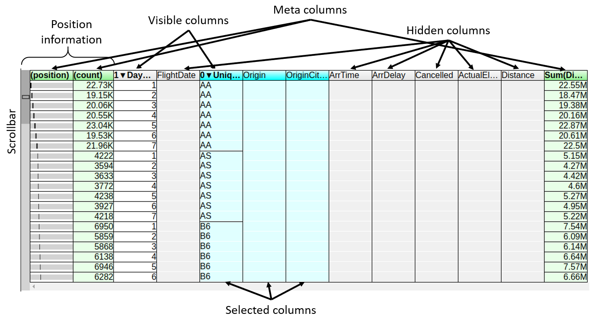
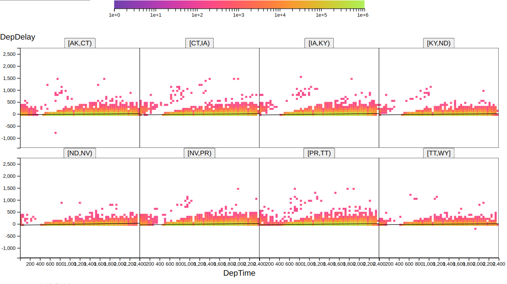

# Hillview User Manual

Hillview is a simple cloud-based spreadsheet program for browsing
large data collections.  Currently the data manipulated is read-only.
Users can sort, find, filter, transform, query, and chart data in some
simple ways; several operations are performed easily using direct
manipulation in the GUI.  Hillview is designed to work on very large
data sets (multi-million rows), complementing tools such as Excel.

Hillview attempts to provide fast data manipulation.  The illusion of
fast manipulation is provided by deferring work: Hillview only
computes as much of the data as must be shown to the user.  For
example, when sorting a dataset, it only sorts the rows currently
visible on the screen.  Hillview performs all operations using a class
of very efficient algorithms, called “Sketches”, which are constrained
to compute with bounded memory over distributed data.

## System architecture

The spreadsheet is a three-tier system, as shown in the following figure:

* The user-interface (UI) runs in a browser.

* The service is exposed by a web server which runs in a datacenter on
  a head node.

* The service runs on a collection of servers in the datacenter;
  ideally these servers also store the data that is being browsed.

The Hillview service is implemented in Java.  The UI is written in
TypeScript.

Hillview can run as a federated system or loosel interconnected
components; the head node only sends small queries to the servers, and
it receivers small results from these.  The data on the server is
never sent over the network; the servers locally compute all results
that are needed.

## Streaming interaction

Users initiate operations in Hillview by performing operations within
the browser.  As a result of an operation, the back-end computes the
result as a series of approximations; these incremental results are
streamed back to the client and rendered, presenting the output with
gradually increasing precision.  Incremental results are always
accompanied by a progress bar, as in the following figure:

Pressing the "stop" button next to a progress bar will cancel the
currently-executing operation.

## Data model

The Hillview data model is a large table, with a relatively small
number of columns (tens) and many rows (millions to billions).

The data in each column is typed; Hillview supports the following data
types:
  * String
  * Category (represented as strings)
  * JSON (represented as strings)
  * Double
  * Integer
  * DateTime
  * Interval

Hillview supports a special value "missing" which indicates that a
value is not present.  This is similar to NULL values in databases.

## Interacting with data

In this section we describe the various ways to present and interact
with the data.

### Loading data sets

Hillview supports reading data from multiple data-sources.

*TODO*

The final UI for loading datasets is not yet implemented.  Currently
this UI consists in some buttons that load pre-defined datasets.

#### Reading CSV files

Hillview can read data from comma- or tab-separated files.

*TODO*

#### Reading data from SQL databases

Hillview can read data from one or many SQL databases (any database
that supports the JDBC standard for reading).

*TODO*

### Table views

The next figure shows a typical table view.

A table view displays only some of the columns of the data.  The
header of the visible columns is written in bold letters.  The
following image shows a table header with 15 columns out of which 3
are visible:

The data in the table is always sorted lexicographically on a
combination of the visible columns.  In the figure above the data is
sorted as follows:

* Data is sorted first on the Origin column in decreasing order (this
  is shown by the down-arrow next to the column name followed by a
  zero; this is the zero-th column in the sorting order)

* When two rows have the same Origin value, they are next compared on
  the UniqueCarrier column, also in decreasing order

* Finally, when two rows have the same value in the Origin and
  UniqueCarrier columns, they are next ordered by their value in the
  Cancelled column, also in decreasing order.

Initially a table view displays no columns.  The user can choose which
columns are displayed or hidden.

The first two columns in the table are special: they do not show data,
but they show information about the displayed data.

The first column, labeled (position) indicates with a horizontal
scroll-bar where in the sorted order the current row resides.  In this
figure the first row is at the beginning of the sorted order (the dark
bar is at the very left).  The second column, labeled (count)
indicates how many instances of this row are present in the dataset.
In this example there are 104,840 instances of this row.  The
scroll-bar also indicates what percentage of the whole dataset is
covered by this row; in this case we can see that this is about 9% of
the data.

#### Scrolling

*TODO*

#### Selecting columns

The user can select one or more column using the mouse:
* Clicking on a column will select the column
* Clicking while pressing shift button will select a range of
  contiguous columns
* Clicking while pressing the control button will add or remove the
  current column from the selection

The following image shows the header of a table with 6 selected
columns.

#### Operations on selected columns

Clicking on a column header pops up a menu that offers a set of
operations on the currently selected columns, as shown in the
following figure:

The contents of this menu may depend on the type of the column and on
the current state of the display.

* Hide: the selected columns will be added to end of the current
  sorting order and the columns will become visible.

* Hide: the selected columns will be removed from the sorting order
  and they will be hidden.

* Sort ascending: The selected columns will be moved to the front of
  the sort order in ascending order.

* Sort descending: The selected columns will be moved to the front of
  the sort order in descending order.

* Heat map: this option requires exactly two columns of suitable types
  to be selected; in this case, it will draw a heatmap plot of the
  data in these two columns.  For Heatmaps see [Heat-map
  views](#heat-map-views).

* Histogram: this option requires exactly one or two columns of
  suitable types to be selected.  If one column is selected, this menu
  will draw a histogram of the data in the selected column.  For
  one-dimensional histograms see
  [Uni-dimensional-histogram-views](#uni-dimensional histogram views).
  If two columns are selected this menu will draw a two-dimensional
  histogram of the data in the selected columns.  For two-dimensional
  histograms see [Two-dimensional
  histograms](#two-dimensional-histograms).

* Heavy hitters...: This will initiate a heavy hitters computation on
  the selected columns; this computation finds the most frequent
  values that appear in the selected columns.  The user is presented
  with a dialog for describing the parameters of the heavy hitters
  computation.

  

  The user has to specify a percentage, between .01 (1/10000 of the
  data) and 100 (the whole data).  The computation will return all
  tuples in the dataset (looking only at the selected columns) that
  occur at least this many times in the dataset.  E.g., if the user
  selects the columns "Origin" and "Destination" and then specifies 1
  for the percentage, the heavy hitters will return a table where the
  Origin-Destination pairs contains only values which appear in more
  than 1% of all rows in the input dataset.

* Filter...: this option will pop-up a dialog window that allows the user
  to filter the data in the selected column (this option requires only
  one column to be selected).  The user can specify a value to be
  sought, and a comparison, indicating whether filtering keeps values
  identical or different to the specified one.

  

* PCA...: principal component analysis.  [Principal Component
  Analysis](https://en.wikipedia.org/wiki/Principal_component_analysis)
  is a method to project data in a high-dimensional space to a
  lower-dimensional space while preserving as much of the "shape" of
  the data.  Initially the user selects a set of columns containing
  numerical data.  The number of columns is the original dimension of
  the data.

  

  The user must indicate the number of dimensions for the projection,
  which has to be smaller than the original number of columns.  The
  PCA analysis will append a set of numeric columns to the dataset,
  containing the result of the PCA analysis.  The name of each
  appended column will indicate the amount of variance in the original
  data that is captured by the column (0-100%).

#### Operations on tables

*TODO*

### Uni-dimensional histogram views

*TODO*

### Two-dimensional histogram views

*TODO*

### Heat-map views

*TODO*

### Arrays of heat-map views

*TODO*

### Combining two views

*TODO*