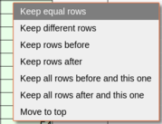
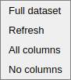
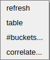
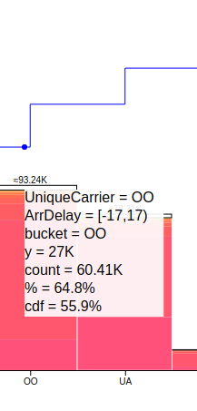
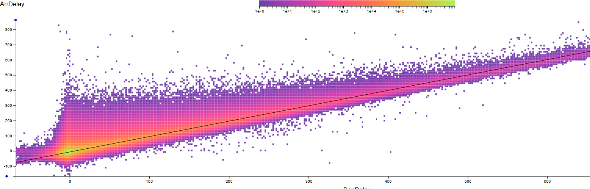

<!-- automatically generated from userManual.src by doc/number-sections.py-->
# Hillview User Manual

[Hillview](https://github.com/vmware/hillview) is a simple cloud-based
spreadsheet program for browsing large data collections.  Currently
the data manipulated is read-only.  Users can sort, find, filter,
transform, query, zoom-in/out, and chart data in simple ways;
operations are performed easily using direct manipulation in the GUI.
Hillview is designed to work on very large data sets (billions of
rows), with an interactive spreadsheet-like interaction style,
complementing sophisticated analytic engines.  Hillview can also be
executed as a stand-alone executable on a local machine (but then the
data size it can manipulate is limited by the available machine
resources).

Hillview attempts to provide fast data manipulation.  The speed is
obtained by deferring work: Hillview only computes as much of the data
as must be shown to the user.  For example, when sorting a dataset, it
only sorts the rows currently visible on the screen.  Hillview
performs all operations using a class of very efficient algorithms,
called “sketches”, which are constrained to compute with bounded
memory over distributed data.

Several of our examples are based on a flights dataset, which contains
one row for an airline flight.  Columns in this dataset include: the date of the flight,
the origin and destination cities, the origin and destination states,
the origin airport code, the distance flown, the departure and arrival delay.

Updated on 2020 Oct 21.

# Contents
  * 1 [Basic concepts](#1-basic-concepts)
    * 1.1 [System architecture](#11-system-architecture)
    * 1.2 [Streaming interaction](#12-streaming-interaction)
  * 2 [Data management](#2-data-management)
    * 2.1 [Data model and supported data types](#21-data-model-and-supported-data-types)
    * 2.2 [Missing values](#22-missing-values)
    * 2.3 [Interval values](#23-interval-values)
    * 2.4 [Data conversions](#24-data-conversions)
      * 2.4.1 [JavaScript conversions](#241-javascript-conversions)
      * 2.4.2 [JDBC conversions](#242-jdbc-conversions)
    * 2.5 [Metadata](#25-metadata)
      * 2.5.1 [Mapping a dataset to a metadata directory](#251-mapping-a-dataset-to-a-metadata-directory)
      * 2.5.2 [Data schema](#252-data-schema)
      * 2.5.3 [Differentially-private metadata](#253-differentially-private-metadata)
      * 2.5.4 [Geographic metadata](#254-geographic-metadata)
        * 2.5.4.1 [Connecting dataset features to geographic metadata](#2541-connecting-dataset-features-to-geographic-metadata)
  * 3 [Interacting with data](#3-interacting-with-data)
    * 3.1 [Error display](#31-error-display)
    * 3.2 [Mouse-based selection](#32-mouse-based-selection)
    * 3.3 [Loading data](#33-loading-data)
      * 3.3.1 [Loading logs](#331-loading-logs)
        * 3.3.1.1 [Example](#3311-example)
        * 3.3.1.2 [Custom Patterns](#3312-custom-patterns)
      * 3.3.2 [Reading generic logs](#332-reading-generic-logs)
      * 3.3.3 [Reading saved dataset views](#333-reading-saved-dataset-views)
      * 3.3.4 [Reading CSV files](#334-reading-csv-files)
      * 3.3.5 [Reading JSON files](#335-reading-json-files)
      * 3.3.6 [Reading ORC files](#336-reading-orc-files)
      * 3.3.7 [Reading Parquet files](#337-reading-parquet-files)
      * 3.3.8 [Reading data from SQL databases](#338-reading-data-from-sql-databases)
        * 3.3.8.1 [Reading data from Greenplum databases](#3381-reading-data-from-greenplum-databases)
        * 3.3.8.2 [Reading from a federated set of MySQL databases](#3382-reading-from-a-federated-set-of-mysql-databases)
        * 3.3.8.3 [Reading data from Cassandra databases](#3383-reading-data-from-cassandra-databases)
    * 3.4 [Navigating multiple datasets](#34-navigating-multiple-datasets)
  * 4 [Data views](#4-data-views)
    * 4.1 [The heading of a view](#41-the-heading-of-a-view)
    * 4.2 [Schema views](#42-schema-views)
      * 4.2.1 [Selecting columns](#421-selecting-columns)
      * 4.2.2 [The schema view menu](#422-the-schema-view-menu)
      * 4.2.3 [The chart menu](#423-the-chart-menu)
      * 4.2.4 [Saving data](#424-saving-data)
    * 4.3 [Table views](#43-table-views)
      * 4.3.1 [Scrolling](#431-scrolling)
      * 4.3.2 [Selecting columns](#432-selecting-columns)
      * 4.3.3 [Operations on selected columns](#433-operations-on-selected-columns)
      * 4.3.4 [Operations on a table cell](#434-operations-on-a-table-cell)
      * 4.3.5 [Operations on a table row](#435-operations-on-a-table-row)
      * 4.3.6 [Operations on tables](#436-operations-on-tables)
      * 4.3.7 [The table view menu](#437-the-table-view-menu)
      * 4.3.8 [The table filter menu](#438-the-table-filter-menu)
    * 4.4 [Frequent elements views](#44-frequent-elements-views)
      * 4.4.1 [View as a Table](#441-view-as-a-table)
      * 4.4.2 [Modify](#442-modify)
  * 5 [Charts](#5-charts)
    * 5.1 [Uni-dimensional histogram views](#51-uni-dimensional-histogram-views)
      * 5.1.1 [The histogram menu](#511-the-histogram-menu)
      * 5.1.2 [The histogram view menu](#512-the-histogram-view-menu)
      * 5.1.3 [Mouse selection in histogram views](#513-mouse-selection-in-histogram-views)
      * 5.1.4 [String histograms](#514-string-histograms)
    * 5.2 [Quartiles view for histogram buckets](#52-quartiles-view-for-histogram-buckets)
    * 5.3 [Two-dimensional histogram views](#53-two-dimensional-histogram-views)
      * 5.3.1 [Selection in 2D histograms](#531-selection-in-2d-histograms)
    * 5.4 [Heatmap views](#54-heatmap-views)
      * 5.4.1 [Selection from a heatmap](#541-selection-from-a-heatmap)
    * 5.5 [Singular value spectrum views](#55-singular-value-spectrum-views)
  * 6 [Trellis plots](#6-trellis-plots)
    * 6.1 [Trellis plots of 1D histograms](#61-trellis-plots-of-1d-histograms)
    * 6.2 [Trellis plots of 2D histograms](#62-trellis-plots-of-2d-histograms)
      * 6.2.1 [Selection using the colormap](#621-selection-using-the-colormap)
    * 6.3 [Trellis plots of heatmaps](#63-trellis-plots-of-heatmaps)
    * 6.4 [Trellis plots of quartile vectors](#64-trellis-plots-of-quartile-vectors)
    * 6.5 [Correlation heatmaps](#65-correlation-heatmaps)
    * 6.6 [Geographic views](#66-geographic-views)
    * 6.7 [Combining two views](#67-combining-two-views)
    * 6.8 [Exporting data to a local CSV file](#68-exporting-data-to-a-local-csv-file)
## 1 Basic concepts

### 1.1 System architecture

Hillview's architecture is shown in the following figure:


* The user-interface (UI) runs in a browser.

* The service is exposed by a web server which runs in a datacenter on
  a root node.

* The service runs on a collection of worker servers in the
  datacenter.  These servers must be able to read the browsed data in
  parallel independently; ideally they store the data that is
  being browsed locally.

The Hillview service is implemented in Java.  The UI is written in
TypeScript.

Hillview can run as a federated system of loosely interconnected
components; the root node only sends small queries to the workers, and
it receives small results from these.  The data on the workers is
never sent over the network; the worker locally compute all views that
are needed to produce the final result.  The root node can store
optional metadata information.  This is described below in the
[metadata](#25-metadata) section.

### 1.2 Streaming interaction

Users initiate operations in Hillview by performing operations within
the browser.  As a result of an operation, the back-end computes the
result as a series of approximations; these incremental results are
streamed back to the client and rendered, presenting the output with
gradually increasing precision.  Incremental results are always
accompanied by a progress bar, as in the following figure:


Pressing the "stop" button next to a progress bar will cancel the
currently-executing operation.

## 2 Data management

Hillview tries to avoid data management as much as possible; Hillview is designed
to ingest data from a variety of external sources, such as databases, distributed
filesystems, raw files of various formats.  However, some amount of data management
is unavoidable - at least Hillview must convert data to and from external representations
to its own internal representation.  In this section we describe how Hillview
manages data and interacts with other data storage systems.

### 2.1 Data model and supported data types

The Hillview data model is a large table, with a relatively small
number of columns (currently tens or hundreds) and many rows (millions
to billions).

The data in each column is typed; Hillview supports the following data
types:

|Datatype|Example|Description|
|:---|---:|:---|
|`None`|missing|All values are _missing_; see [missing values](#22-missing-values)..|
|`String`|`California`|Represents Unicode strings; although Hillview does not set a limit on the string length, is does not handle very well very long strings.|
|`Json`|`{a:2,b:3}`|Strings that represent legal JSON values.|
|`Double`|`2.4352e2`|64-bit IEEE floating point values.|
|`Integer`|`100`|32-bit signed integer values.|
|`Date`|`2000/01/01 10:32:45.003`|A date, including time and timezone.  The precision of times in dates is limited to milliseconds.  Timezone information not currently displayed.|
|`LocalDate`|`2000/01/01 10:32:45.003`|A date including time, but without any timezone information. The precision of times in local dates is limited to milliseconds.|
|`Time`|`10:32:45.003`|A time within a day. The precision of times in local dates is limited to milliseconds|
|`Duration`|`2 days 05:20:00`|Differences between two times.|
|`Interval`|`[3:4]`|An interval contains two double values.  See also [interval values](#23-interval-values).|

### 2.2 Missing values

Hillview supports a special value "missing" which indicates that a
value is not present.  This is similar to NULL values in databases.
When sorting missing values are considered larger than any other value.

### 2.3 Interval values

Hillview supports columns whose value is an interval of two numeric values.
These columns can be created by combining two existing numeric columns.
The intervals are not "ordered": there is no requirement for the interval start
to be smaller than the end.  If either interval endpoint is missing the whole interval
value is missing.  The intervals are always closed, including both endpoints.

There is currently no support for storing such columns or reading them from
external sources.

In a table these columns are displayed in the form [start : end], as shown in the following
image.


Intervals are sorted lexicographically.  Intervals behave specially in
histogram plots: an interval contributes to each bucket that it overlaps.
For example, if we plot a histogram with 10 buckets of values between 0 and 9,
the interval [2.5 : 3.5] will increment the counts in buckets [2,3) and [3,4).
The interval [2 : 3] will increment the counts in buckets [2,3) and [3,4) as well, because
the endpoint 3 overlaps with the bucket [3,4).  The "range" of a column of interval
is from the minimum of all endpoints the the maximum of all endpoints.  Because
intervals are not "ordered", the interval [3 : 2] will also increment the counts
in buckets [2,3) and [3,4).

In Javascript the intervals are exposed as arrays with two numeric values.

### 2.4 Data conversions

This section describes how Hillview data is represented in various external
representations.

#### 2.4.1 JavaScript conversions

Hillview allows users to write data transformation and filtering functions in JavaScript.
Here is how various Hillview datatypes are represented in JavaScript:

|Datatype|JavaScript representation|
|:---|:---|
|None|null|
|`String`|A JavaScript string.|
|`Json`|A JavaScript string that can be parsed into a JavaScript object.|
|`Double`|A JavaScript number.|
|`Integer`|A JavaScript number.|
|`Date`|A JavaScript `Date` object.|
|`LocalDate`|A JavaScript `Date` object adjusted for the local timezone offset.|
|`Time`|A JavaScript `Date` object with a date component of "zero".|
|`Duration`|A JavaScript number representing the number of milliseconds in the duration.|
|`Interval`|An array with two JavaScript number values.|

#### 2.4.2 JDBC conversions

When reading data from a JDBC source Hillview applies the following conversions:

|JDBC datatypes|Hillview representation|
|-------------|-----------------------|
|`TINYINT`,`SMALLINT`,`INTEGER`|`Integer`|
|`BOOLEAN`,`BIT`|`String` (false,true)|
|`BIGINT`,`FLOAT`,`REAL`,`DOUBLE`,`DECIMAL`,`NUMERIC`|`Double`|
|`CHAR`,`VARCHAR`,`LOGVARCHAR`,`NVARCHAR`,`LONGNVARCHAR`,`SQLXML`|`String`|
|`DATE`,`TIME`,`TIMESTAMP`|`Localdate`|
|`TIME_WITH_TIMEZONE`,`TIMESTAMP_WITH_TIMEZONE`|`Date`|
|`NULL`|`None`|
|Other|Error: not supported|

### 2.5 Metadata

This section describes various kinds of metadata manipulated by Hillview.
The hillview root node stores the optional metadata in a directory called
`metadata`.  The structure of this directory is as follows:

|Directory|Contents|
|---------|--------|
|`data/geo`|Geographic metadata common to all datasets (e.g., maps)|
|`data/metadata`|Root directory for metadata; has one subdirectory for each dataset|
|`data/metadata/differential-privacy`|Root directory for differentially-private metadata; has one subdirectory for each dataset|
|`data/metadata/geo`|Root directory for geographic metadata; has one subdirectory for each dataset|

#### 2.5.1 Mapping a dataset to a metadata directory

Hillview uses some conventions in the structuring of directories on the root
note in order to associate metadata information on the
root node with data on the worker nodes.

Let us consider a set of ORC files stored on the worker nodes in
directory `dataset/example/*.orc`.  The following files are metadata files
associated with this dataset on the root node:

* `data/metadata/geo/dataset/example/geometa.json` - metadata describing
   how the columns in this dataset are mapped to geographic features
* `data/metadata/differential-privacy/dataset/example/privacy_metadata.json` -
   metadata describing the differential privacy parameters a dataset
   that only supports only private visualizations

#### 2.5.2 Data schema

For some file formats that are not self-describing Hillview uses a
`schema` file to specify the format of the data.  The following is an
example of a schema specification in JSON for a table with 2 columns.
The "schema" file can be stored either on the worker nodes, in the same place
where the data resides, or on the root node.

```JSON
[{
    "name": "DayOfWeek",
    "kind": "Integer"
}, {
    "name": "FlightDate",
    "kind": "LocalDate"
}]
```

The schema is an array of JSON objects each describing a column.  A
column description has two fields:

* name: A string describing the column name.  All column names in a
  schema must be unique.

* kind: A string describing the type of data in the column,
  corresponding to the types in the [data model](#21-data-model-and-supported-data-types).

#### 2.5.3 Differentially-private metadata

TODO

#### 2.5.4 Geographic metadata

The directory `data/geo` on the root node can contain various
with geographic information data.  We currently support
[shape files](https://en.wikipedia.org/wiki/Shapefile).
The organization of these files on disk is not mandated by
Hillview.

##### 2.5.4.1 Connecting dataset features to geographic metadata

For each dataset that contains columns that can be mapped to a geographic feature
a metadata file can describe the connection between the values in the
data columns and a specific geographic feature.  This is an array of
objects, one per column, stored in a file called `geometa.json`.

```Json
[{
  "columnName": "OriginState",
  "geoFile": "data/geo/us_states/cb_2019_us_state_20m.shp",
  "property": "STUSPS",
  "projection": "geoAlbersUsa"
}, {
  "columnName": "DestState",
  "geoFile": "data/geo/us_states/cb_2019_us_state_20m.shp",
  "property": "STUSPS",
  "projection": "geoAlbersUsa"
}]
```

Here is the interpretation of the four fields in each object:

|Field|Interpretation|
|-----|--------------|
|columnName|The name of a column in this dataset|
|geoFile|The path of a geographic information file in the root node that stores geographic information corresponding to values in this column. We recommend these files to be stored under `data/geo`|
|property|Property in the geographic information file that corresponds to values in the dataset column.  For example, a geoFile about US states may two properties: one with US postal codes, and one with state names.  This column describes which property is expected to be found in the data.|
|projection|Map projection to use to convert the data to a map on the screen.  Legal values are shown below.|
            
This is a list of legal map projections supported.  For more on
the meaning of these projections, see for example
[D3 projections](https://d3-wiki.readthedocs.io/zh_CN/master/Geo-Projections/).
* geoAzimuthalEqualArea
* geoAzimuthalEquidistant
* geoGnomonic
* geoOrthographic
* geoStereographic
* geoEqualEarth
* geoAlbersUsa
* geoConicEqualArea
* geoConicEquidistant
* geoEquirectangular
* geoMercator
* geoTransverseMercator
* geoNaturalEarth1

## 3 Interacting with data

In this section we describe the various ways to present and interact
with the data.

### 3.1 Error display

Some operations can trigger errors.  For example, the attempt to load
a non-existent file.  These errors usually manifest as Java exceptions
in the backend.  Today the Hillview front-end captures these
exceptions and displays them on the screen.  We are working to improve
the usability of error messages.


### 3.2 Mouse-based selection

Several views allow the user to use the mouse to select data.
Selections can be modified using the keyboard as follows:

* Clicking on an element will select it and will unselect all other
  selected elements.

* Clicking while pressing shift button will select or unselect a whole
  range of contiguous elements.

* Clicking while pressing the control button
  will toggle the selection of the current element, while leaving the
  selection status of other elements unchanged.

### 3.3 Loading data

Hillview supports reading data from multiple data-sources.

When the program starts the user is presented with a Load menu.


The load menu allows the user to specify a dataset to load from
storage.

* Hillview logs: when this option is selected Hillview loads the logs
  produced by the Hillview system itself as a table with 9 columns.
  This is used to debug the Hillview system itself.

* Generic logs: allows the user to [read logs from a set of log
  files](#332-reading-generic-logs).

* Saved view: allows the user to [read data from a saved
  view](#333-reading-saved-dataset-views).

* CSV files: allows the user to [read data from a set of CSV
  files](#334-reading-csv-files).

* JSON files: allows the user to [read the data from a set of JSON
  files](#335-reading-json-files).

* Parquet files: allows the user to [read the data from a set of
  Parquet files](#337-reading-parquet-files).

* ORC files: allows the user to [read the data from a set of ORC
  files](#336-reading-orc-files).

* Federated DB tables: allows the user to [read data from a set of federated
  or distributed databases](#338-reading-data-from-sql-databases).

After the data loading is initiated the user will be presented with a
view of the loaded table.  If the table has relatively few columns,
the user is shown directly a [Tabular view](#43-table-views).  Otherwise
the user is shown a [Schema view](#42-schema-views), which can be
used to select a smaller set of columns to browse.

#### 3.3.1 Loading logs

We use on the grok library for parsing distributed logs.
For more info visit https://github.com/thekrakken/java-grok/blob/master/README.md

Grok works by combining text patterns into something that matches your logs.

The syntax for a grok pattern is %{SYNTAX:NAME}

* SYNTAX : The pattern that will match your text. For example, 3.44 will be matched
by the "NUMBER" pattern and 55.3.244.1 will be matched by the "IP" pattern

* NAME : An identifier naming the matched text. For example, 3.44 could be the duration
of an event, so you could call it simply "duration". Further, a string 55.3.244.1 might
identify the "client" making a request

For the above example, your grok pattern would look something like this:
```
%{NUMBER:duration} %{IP:client}
```
For more patterns : https://github.com/thekrakken/java-grok/blob/master/src/main/resources/patterns/patterns

##### 3.3.1.1 Example

Given this line from a syslog log:
```
Sep 17 06:55:14,123 pndademocloud-hadoop-dn-3 CRON[25907]: (CRON) info (No MTA installed, discarding output)
```

This line can be parsed with the following pattern:
```
%{SYSLOGTIMESTAMP:timestamp} (?:%{SYSLOGFACILITY} )?%{SYSLOGHOST:logsource} %{GREEDYDATA:message}
```

This creates the following log record.
```
logsource : pndademocloud-hadoop-dn-3
message   : CRON[25907]: (CRON) info (No MTA installed, discarding output)
timestamp : Sep 17 06:55:14.123
```

##### 3.3.1.2 Custom Patterns

Hillview supports certain pre-defined log format patterns. You have an option to define custom log format patterns
to suit your needs and specify the same in the logFormat field in the UI (under Generic Logs). Given a log pattern
and a set of files, what you will get in Hillview is a table with columns corresponding to the names that you gave to the patterns.

#### 3.3.2 Reading generic logs

Hillview can read data from log files with diffrent log formats. The
following menu allows the users to specify the files to load.  *The
files must be resident on the worker machines where the Hillview service
is deployed*.


* Folder: Folder containing the files to load.

* File name pattern: A shell expansion pattern that names the files to
  load.  Multiple files may be loaded on each machine.

* Log format: The [log format](#331-loading-logs) of the logs.

#### 3.3.3 Reading saved dataset views

Hillview can reload all the data views associated with a datased.
A collection of views can be saved to a file from the dataset tab menu,
as described in [Navigating multiple datasets](#34-navigating-multiple-datasets).
The following menu allows the users to specify the files to load.


* File: A file containing the bookmarked data to load.

* Tab label: A name to display for dataset.

#### 3.3.4 Reading CSV files

Hillview can read data from comma- or tab-separated files. The
following menu allows the users to specify the files to load.  *The
files must be resident on the worker machines where the Hillview service
is deployed*.


* Folder: Folder containing the files to load.

* File name pattern: A shell expansion pattern that names the files to
  load.  Multiple files may be loaded on each machine.

* Schema file: An optional [schema file](#252-data-schema)
  in JSON format that describes the schema of the data.  In the
  absence of a schema file Hillview attempts to guess the type of data
  in each column.  The schema file must reside in same folder.

* Header row: select this option if the first row in each CSV file is
  a header row; the first row is used to generate names for the
  columns in the absence of a schema.  If a schema is supplied the
  first row is just ignored.

All the CSV files must have the same schema (and the same number of
columns).  CSV files may be compressed (e.g., using gzip or other
compression tools).  CSV fields may be quoted using double quotes, and
then they may contain newlines.  An empty field (contained between two
consecutive commas, or between a comma and a newline) is translated to
a 'missing' data value.

When parsing dates Hillview assumes that all rows will be using the same date format,
and it attempts to guess a suitable parsing format.

#### 3.3.5 Reading JSON files

Hillview can read data from JSON files. The following menu allows the
users to specify the files to load.  *The files must be resident on
the worker where the Hillview service is deployed*.


* Folder: Folder containing the files to load.

* File name pattern: A shell expansion pattern that names the files to
  load.  Multiple files may be loaded on each machine.

The assumed format is as follows:
- the file contains a single JSON array
- the array elements are flat JSON objects
- each value will become a row in the table
- all JSON objects have the same structure (schema)
- JSON objects generate a column for each property

All the JSON files must have the same schema.  JSON files may be
compressed.

#### 3.3.6 Reading ORC files

Hillview can read data from [Apache ORC
files](https://github.com/apache/orc), a columnar storage format.
*The files must be resident on the worker machines where the Hillview
service is deployed*.  Hillview only supports files whose ORC schema
is an ORC struct with scalar types as fields.


* Folder: Folder containing the files to load.

* File name pattern: A shell expansion pattern that names the files to
  load.  Multiple files may be loaded on each machine.

* Schema file: An optional [schema file](#252-data-schema)
  in JSON format that describes the schema of the data.  The schema
  file must reside in same folder, and it must be compatible with the
  ORC schema.

Here is how ORC types are converted to Hillview types.

|ORC type|Hillview value|
|--------|--------------|
|`BOOLEAN`|`String` (false/true)|
|`BYTE`|`Integer`|
|`SHORT`|`Integer`|
|`INT`|`Integer`|
|`LONG`|`Double`|
|`FLOAT`|`Double`|
|`DOUBLE`|`Double`|
|`STRING`|`String`|
|`DATE`|`LocalDate`|
|`TIMESTAMP`|`LocalDate`|
|Other|Not yes supported|

If the user supplies a schema
file it will perform type conversions at loading time, as follows:

|ORC type|Specified type|Hillview value|
|--------|--------------|--------------|
|`BOOLEAN`|`Integer`|Integer (0/1)|
|`BYTE`|`String`,`Json`|number converted to string|
|`BYTE`|`Double`|number converted to double|
|`SHORT`|`String`,`Json`|number converted to string|
|`SHORT`|`Double`|number converted to double|
|`INT`|`String`,`Json`|number converted to string|
|`INT`|`Double`|number converted to double|
|`LONG`|`String`,`Json`|number converted to string|
|`LONG`|`Integer`|number converted to integer; error on overflow|
|`FLOAT`|`String`,`Json`|number converted to string|
|`FLOAT`|`Integer`|number converted to integer; error on overflow|
|`DOUBLE`|`String`,`Json`|number converted to string|
|`DOUBLE`|`Integer`|number converted to integer; error on overflow|
|`STRING`|`Json`|`String`|
|`STRING`|`Integer`|Parse string to integer; error when parsing fails|
|`STRING`|`Double`|Parse string to double; error when parsing fails|
|`DATE`|`String`,`Json`|Date converted to Json|
|`DATE`|`Date`|Convert to date assuming that the timezone is UTC|
|`TIMESTAMP`|`String`,`Json`|`String` representation of the date|
|`TIMESTAMP`|`Date`|Convert to date assuming that the timezone is UTC|

#### 3.3.7 Reading Parquet files

Hillview can read data from [Apache Parquet
files](http://parquet.apache.org), a columnar storage format.  The
[Impala](https://impala.apache.org/) database uses Parquet to store
data.  *The files must be resident on the worker machines where the
Hillview service is deployed*.


* Folder: Folder containing the files to load.

* File name pattern: A shell expansion pattern that names the files to
  load.  Multiple files may be loaded on each machine.

The following table describes data conversion rules between Parquet data types
and Hillview data types:

|Parquet type|Hillview type|
|INT64|`Double`|
|FLOAT|`Double`|
|DOUBLE|`Double`|
|INT32|`Integer`|
|BOOLEAN|`String` (true/false)|
|BINARY|`String`|
|FIXED_LEN_BYTE_ARRAY|`String`|
|INT96|`LocalDate`|
|other|Error - conversion fails|

#### 3.3.8 Reading data from SQL databases

The following menu allows the user to load data from a
parallel database or a federated set of databases that expose some JDBC services.
The following menu allows the user to specify the data to load.


* database kind: A drop-down menu indicating the kind of database to
  load data from.  Currently we support 'mysql',
  'greenplum', and 'cassandra'.  Each of these is discussed in a separate
  section below.

* host: The network name of a machine hosting the database.

* port: The network port where the database service is listening.

* database: The database to load data from.

* table: The table to load data from.

* user: The name of the user connecting to the database.

* password: Credentials of the user connecting to the database.

##### 3.3.8.1 Reading data from Greenplum databases

Hillview can read data from a [Greenplum massively parallel database](https://greenplum.org/).
The following diagram illustrates how Hillview interact with Greenplum.


* The hillview root node can run anywhere (including the same machine as the Master Host),
  but it needs to be able to open
  a JDBC connection to the Greenplum Master Host.  The Master Host must be specified
  as `host` in the connection dialog shown in [the section above](#338-reading-data-from-sql-databases).
  The default network port for Greenplum is `5432`.

* Each hillview worker must be deployed on the same machine which contains a
  Greenplum segment host, to ensure high bandwidth access to the data.
  The Hillview [configuration file](../README.md#31-service-configuration)
  should have one worker for each segment host.  Hillview aggregators are
  optional.  This requires Java to be installed on all segment machines.

* The Hillview workers network port must be allowed by the network firewall.

* The Hillview workers must be able to read and delete files written by the
  Greenplum segment hosts.

* We provide a script `../bin/deploy-greenplum.py` to aid in the deployment
  of Hillview next to a Greenplum database.  The script is invoked with a
  Hillview cluster configuration file as an argument.

The interaction between Hillview and Greenplum proceeds as follows:

1. The user initiates a connection to a Greenplum database by filling the
   form shown in [the section above](#338-reading-data-from-sql-databases).

2. The Hillview root node initiates a JDBC connection to the Greenplum
   Master host.  Using this connection the Hillview root node obtains
   the schema of the data.

3. The Hillview root node instructs Greenplum to dump the data in the
   table in parallel on all segment hosts (using Greenplum
   [EXTERNAL WEB TABLES](https://gpdb.docs.pivotal.io/6-10/ref_guide/sql_commands/CREATE_EXTERNAL_TABLE.html)).

4. The Hillview root node instructs all hillview workers to read the
   dumped data, passing along the schema previously obtained.

5. From this point on Hillview no longer needs to interact with Greenplum.

##### 3.3.8.2 Reading from a federated set of MySQL databases

The image below shows a system where Hillview reads directly from a set of
independent MySQL databases (this can be easily extended
to any database that supports JDBC).


In this model an independent Hillview worked is deployed on each machine
hosting a database.  The main assumption is that the data management system
shards tables across databases such that different shards of a table
are stored with the same table name across different databases.
Hillview allows the user to visualize the union of all table fragments.
The JDBC connection parameters introduced by the user in the dialog
shown in [the section above](#338-reading-data-from-sql-databases) describe
simultaneoulsy all connections from the workers.

##### 3.3.8.3 Reading data from Cassandra databases

Hillview can read data from [Cassandra distributed databases](https://cassandra.apache.org/).
For this purpose a Hillview worker should be deployed on each Cassandra node.
Moreover, Hillview must have read access to Cassandra's SSTables.
Hillview assumes that no writes are in progress while reading the
data from storage.


The following menu allows the user to specify the data to load.


* database kind: Indicating the kind of database that we will connect 
  to, which is Cassandra. We also support another DB, 'mysql' and 
  'impala'.

* host: One of the network name/IP address of the machines hosting 
  Cassandra cluster. Every node in Cassandra cluster are the same 
  (no master-slave concept), thus Hillview can connect to any node.

* db directory: The directory where Cassandra is located/installed.
  
* port: The network port where Cassandra service is listening.

* jmx port: The JMX port where Cassandra does inter-node communication.

* database: The database/keyspace to load data from.

* table: The table to load data from.

* user: The name of the user connecting to the database.

* password: Credentials of the user connecting to the database.

### 3.4 Navigating multiple datasets

The Hillview user interface uses a tabbed web page to display multiple
datasets; each dataset is opened in a separate tab.  Even if the same
dataset is loaded a second time, it will be displayed in a new tab.
The current dataset is shown in a highlighted tab (white in the image
below).  The dataset name is shown in the tab; the user can modify
the displayed dataset name by clicking on it.


By clicking on a dataset tab the user will bring the dataset into
view.  A tab can be closed by clicking on the red x sign in the tab.
The currently-selected dataset is displayed below the line of tabs;
the page contains simultaneously multiple different views of a
dataset.

Right-clicking a tab brings up a tab-specific menu:


The tab menu offers the following options:

* Bookmark this tab.  Choosing this option will create a unique URL
for this dataset, which is displayed to the user:


This URL can be loaded later (or shared with other users) to display the
exact same view that is currently displayed.  This view can be reconstructed
as long as the server-side data does not change.

* Save this tab to file.  This saves the data describing this view into a JSON
file.  The data can be loaded back from the
[load menu](#33-loading-data) as described in
[Reading saved dataset views](#333-reading-saved-dataset-views).  The file
can also be sent to other users, who will be able to open
the exact same view.  This functionality is similar to the above
"bookmark", but does not keep any server-side data.

* Reload original view: in case the first page of the view was accidentally
closed, this option will reopen it.

* Refresh: fetches and redraws all the views associated with this dataset.

* Edit privacy policy: this is an experimental feature related to
  differentially-private data visualizations, which is not yet documented.
  This option is only enabled for a data curator while visualizing a
  private dataset.

## 4 Data views

As the user navigates the dataset new views are opened and displayed.
This image shows a browser window containing multiple views of the
same dataset; three views are visible in the browser window, and the
user needs to scroll up and down to see the views.


### 4.1 The heading of a view

Each view has a heading that describes it briefly, as shown in the
following figure.  Each view has a unique number, shown before the
title.  The title can be edited by clicking on it.
The lineage of views is usually shown in the title, allowing
users to navigate from a view to the source view from which it was
generated.  Views can also be closed by clicking the button marked
with x.


The color picker rectangle allows you to change the color of the title
to make it easier to visually navigate; the color of a view is inherited
by all views that are spawned by it.
The two black triangles in the view heading allow the view to be moved
up and down on the web page.  The axis markers X, Y, and G can be
dragged between some views; dropping them will "move" the
corresponding axis from the source view to the target view.  (G stands
for the "group-by" axis in a Trellis plot view.)

### 4.2 Schema views

The data schema views allow users to browse the schema of the current
table and select a set of columns from the dataset to focus on. This
feature is especially useful when the table contains too many columns
to display at once, and the user wants to focus on a subset of them.

The following example shows a schema view; the rows in a schema view
are the description of the columns of the data table.  In this example
there are three rows selected.


The schema view allows users to view the columns of the dataset and to
select a subset of columns to browse in detail.  The schema view has a
menu with the following options:


* Save as: allows the user to [save a copy of the data](#424-saving-data)
  in a different format; *the data is saved on the cluster where the
  service is running*

* View: allows the user to [change the way data is
  displayed](#422-the-schema-view-menu)

* Chart: allows users to [draw charts](#423-the-chart-menu) of one or two
  colums

* Combine: allows users to [combine data in two
  views](#67-combining-two-views)

#### 4.2.1 Selecting columns

There are two ways to modify the selection:
1. By [using the mouse](#32-mouse-based-selection).

2. Using the selection menus, which can be accessed either by
right-clicking on the **Name**, **Type** or **Allows Missing** column
headers, or by clicking on the **Select** menu option at the top left
as shown below.


Columns can be un/selected using either the name, type, or, if already
computed, by basic statistics.  We describe
the search criteria allowed in detail below.  In all cases, the search
returns a subset of column descriptions, which are added to
the current selection.

* By Name: allows regular expression matching against the name of the column.


* By Type: allows choosing all columns of a particular type.


* By Statistics:

[!Select by statistics](select-by-statistics.png)

Allows the user to select all columns that have only "missing" value
or all columns where the standard deviation is much smaller than the mean
(the user can specify a threshold for the ratio of the two).

Once the user selects a set of column descriptions, they can display a view of the
data table restricted to the selected columns using the View/Selected columns menu.
Right-clicking on a selected set of descriptions opens up a context menu


The following operations can be invoked through the context menu:
* Show as table: this displays a [table view](#43-table-views) of the
  data restricted to the selected columns.

* Histogram: draws a [1D](#51-uni-dimensional-histogram-views) or
  [2D](#53-two-dimensional-histogram-views) histogram of the selected
  columns

* Heatmap: draws a [heatmap](#54-heatmap-views) view of the selected columns.

* Trellis histogram: draw the selected columns using a Trellis view of
  [1D](#61-trellis-plots-of-1d-histograms) or
  [2D](#62-trellis-plots-of-2d-histograms) histograms

* Trellis heatmaps: draw the selected columns using a [Trellis
  view](#63-trellis-plots-of-heatmaps) of heatmaps

* Estimate distinct elements: estimate the number of distinct values in this column

* Filter...: opens up a filter menu that allows the user to filter data based on values in the selected column.
  See the description of the filter operation [below](#433-operations-on-selected-columns).

* Compare...: compares the data in the column with a specified constant.
  See the description of the compare operation [below](#433-operations-on-selected-columns).

* Create column in JS...:
  See the description of the create column operation [below](#433-operations-on-selected-columns).

* Rename...: shows up a menu that allows the user to rename this column

* Frequent elements...: shows up a menu that allows the user to find frequent elements
  See the description of the frequent elements operation [below](#433-operations-on-selected-columns).

* Basic statistics: shows for each selected column some basic statistics, as in the following figure:

  

#### 4.2.2 The schema view menu


* Selected columns: this displays a [table view](#43-table-views) of the
data restricted to the selected columns.

#### 4.2.3 The chart menu

The user can also directly draw a chart of the data in a selected set
of columns using the chart menu:


* 1D Histogram...: presents a dialog allowing the user to
  select a column whose data will be drawn as a
  [uni-dimensional histogram view](#51-uni-dimensional-histogram-views).


* 2D Histogram...: presents a dialog allowing the
  user to select two columns whose data will be drawn as a
  [two-dimensional histogram view](#53-two-dimensional-histogram-views).


* Heatmap...:  presents a dialog allowing the user to
  select two columns whose data will be drawn as a [heatmap](#54-heatmap-views).


* Trellis histograms...: presents a dialog allowing the user to
  select two columns to use to display a [Trellis histogram view](#61-trellis-plots-of-1d-histograms).

* Trellis 2D histograms...: presents a dialog allowing the user to select three columns
  to use to display a [Trellis 2D histogram view](#62-trellis-plots-of-2d-histograms).

* Trellis heatmaps...: presents a dialog allowing the user to select three columns to use
  to display a [Trellish plot of heatmaps](#63-trellis-plots-of-heatmaps).

#### 4.2.4 Saving data

* This menu allows users to save the data in a different format as
  files on the worker machines.  It is only enabled for authorized users.


* Save as ORC files: allows users to specify how data should be saved
  in the [ORC file format](#336-reading-orc-files).


The user can specify a folder on the remote worker machines.  Each
file in the current dataset will be saved as a new file in ORC format
in the specified folder.

* Save as CSV files: allows users to specify how data should be saved
  in the [CSV file format](#334-reading-csv-files).

The user can specify a folder on the remote worker machines.  Each
file in the current dataset will be saved as a new file in comma-separated value format
in the specified folder, with a header.

* Save as DB table: this option is only available if the user has loaded the
data from a federated database.  In this case, the user is allowed to save
the data back to the federated database into a table that they can specify.

### 4.3 Table views

The next figure shows a typical table view.


The columns in a table view are colored as follows:

* Columns that are hidden are shown in gray

* Columns that are visible are shown in white

* Columns that contain metadata are shown in green.  Metadata columns
  do not actually exist in the dataset, they are computed only when
  displaying a view.  For example, the second column always shows the
  count of rows that have a specific value.  Metadata columns do not
  offer all operations that are available on data columns.

Double-clicking on a column separator will enlarge the column to the
left of the mouse to fit the displayed data.

The data in the table is always sorted lexicographically on a
combination of the visible columns.  In the figure above the data is
sorted as follows:

* Data is sorted first on the Origin column in decreasing order (this
  is shown by the down-arrow next to the column name followed by a
  zero; this is the zero-th column in the sorting order)

* When two rows have the same Origin value, they are next compared on
  the UniqueCarrier column, also in decreasing order

* Finally, when two rows have the same value in the Origin and
  UniqueCarrier columns, they are next ordered by their value in the
  Cancelled column, also in decreasing order.

This display is equivalent to the output of the following SQL query:

```SQL
SELECT COUNT(*), Sum(Distance), DayOfWeek, UniqueCarrier FROM data
GROUP BY DayOfWeek, UniqueCarrier
ORDER BY dayOfWeek ASC, UniqueCarrier ASC
LIMIT 20
```

Initially a table view displays no columns.  The user can choose which
columns are displayed or hidden.

Missing values are shown with a different color.


In the tabular display a visible row can correspond to multiple rows
in the original dataset.  For example, in this figure, the first
displayed row corresponds to 22.73 thousands different rows in the
dataset.  Otherwise said, if one ignores all columns except the 2
visible ones, there are 22.73 thousand rows that have these exact
values in the 2 visible columns (1/SFO).  This is displayed in the
first two columns of the table:


The first column, labeled (position) indicates with a horizontal
bar where in the sorted order the current displayed row
resides.  In this figure the first row is at the beginning of the
sorted order (the dark bar is at the very left).  The second column,
labeled (count) indicates how many rows in the dataset correspond to
the displayed row.  The horizontal bar also indicates what percentage of
the whole dataset is covered by this.  You can see that, although the
table only has 20 rows, it actually displays information for 212 thousand
rows in the original dataset, or 24% of the data!

#### 4.3.1 Scrolling

Because each displayed row summarizes information from multiple rows,
scrolling through a Hillview table is somewhat different from the
standard scrolling.  The scroll-bar image and interaction reflect
these differences.  The following image is a blow-up of the scroll bar
of the table above.


The "visible region" of the scroll-bar size depicts the amount of
information displayed.  In the previous figure the visible region is
about 1/4 of the scroll-bar, this indicates that the data displayed
covers 1/4 of the rows in the dataset.

The scroll-bar can be moved using the keyboard (page up, page down,
home and end), or dragged using the mouse.  When moving the scroll-bar
the size of the "visible region" can change, sometimes dramatically,
depending on the distribution of the values in the visible columns.

To drag the scroll-bar with the mouse one has to grab the narrow
scroll-bar handle which is at the middle of the visible region.
Dragging the scroll-bar allows the user to specify a *quantile* in the
sorted data-set.  For example, if the user drags the handle to the
middle of the scroll-bar, this indicates that the user wants to know
the rows around the *median* of the distribution.  Hillview will bring
into view a set of rows that includes the requested quantile.

#### 4.3.2 Selecting columns

The user can [select](#32-mouse-based-selection) one or more column using
the mouse.  The figure above shows table with 3 selected columns.

#### 4.3.3 Operations on selected columns

Double-clicking on a column header will show or hide the data in that
column.

Right-clicking on a column header pops up a menu that offers a set of
operations on the currently selected columns, as shown in the
following figure (some items, like "charts", are triggered by mousing over).


The contents of this menu may depend on the type of the column and on
the current state of the display.

* Show: the selected columns will be added to end of the current
  sorting order and the columns will become visible.

* Hide: the selected columns will be removed from the sorting order.

* Drop: the selected column will be removed from the set of displayed
  columns.  There is no operation to bring back the column once it has
  been dropped from a view.  Note that the column is only dropped from
  the *current* views; other views that are displaying the column will
  continue to display it.

* Estimate distinct elements: selecting this option will run a
  computation that estimates the number of distinct values that exist
  in the selected column.  The shown number is just an approximation,
  but it should be a good approximation.

* Sort ascending: The selected columns will be moved to the front of
  the sort order in ascending order.

* Sort descending: The selected columns will be moved to the front of
  the sort order in descending order.

* Charts:

    * Histogram: this option requires exactly one or two columns to be
      selected.  If one column is selected, this operation will draw a
      histogram of the data in the selected column.  See
      [Uni dimensional histogram views](#51-uni-dimensional-histogram-views).
      If two columns are selected this menu will draw a two-dimensional
      histogram of the data in the selected columns.  For two-dimensional
      histograms see [Two-dimensional
      histograms](#53-two-dimensional-histogram-views).

    * Quartiles: this option requires exactly two columns to be selected.
      The first column is used to create histogram buckets, and for
      each bucket the distribution of the data in the second column will be summarized
      as a [vector of quartiles](#52-quartiles-view-for-histogram-buckets).

    * Heatmap: this option requires exactly two columns to be selected.
      This displays the data in these columns as a [Heatmap
      view](#54-heatmap-views).

    * Trellis histograms: this option requires exactly two or three
      columns to be selected.  If two columns are selected, this operation
      will draw a trellis plot of 1-dimensional histogram of the data in
      the first selected column grouped by the second column.  See
      [Trellis plots of 1D histograms](#61-trellis-plots-of-1d-histograms).
      If two columns are selected this menu will draw a two-dimensional
      histogram of the data in the selected columns.  For two-dimensional
      histograms see [Two-dimensional
      histograms](#53-two-dimensional-histogram-views).

    * Trellis heatmaps: this options requires exactly 3 columns to be
      selected.  This displays the data as a [Trellis plot
      view](#63-trellis-plots-of-heatmaps).

    * Map: this option requires either one or two columns to be selected.
      The first column is used as a geographic feature name.  The second
      column must be an aggregate column; if no second column is selected
      the "count" aggregate column is used.  This displays the data on a
      [Geographic view](#66-geographic-views).

* Rename...: this operation requires exactly one column to be selected.
  The user can type a new name for this column.  The new name will be
  used for this column.  Note that other views that are already
  displaying the column will continue to use the old name for this
  column.

* Frequent elements...: finds the most frequent values that appear in
  the selected columns.  The user is presented with a dialog
  requesting the threshold parameter for the frequent elements
  computation.

  

  The user has to specify a percentage, between .01 (1/10,000 of the
  data) and 100 (the whole data).  The result is all items whose
  frequency in the selected columns is above the threshold. the result
  is shown in a [frequent elements view](#44-frequent-elements-views).

* Correlation: Computes pairwise-correlations between all selected columns.
  This is displayed as a [triangular matrix of heatmaps](#65-correlation-heatmaps).
  This option is only available for numeric columns.

* PCA...: principal component analysis.  [Principal Component
  Analysis](https://en.wikipedia.org/wiki/Principal_component_analysis)
  is a method to project data in a high-dimensional space to a
  lower-dimensional space while preserving as much of the "shape" of
  the data.  The user must have selected a set of columns containing
  numerical data.  The number of columns is the original dimension of
  the data.

  

  The user must indicate the number of dimensions for the projection,
  which has to be smaller than the original number of columns.  The
  PCA analysis will append a set of numeric columns to the dataset,
  containing the result of the PCA analysis.  The name of each
  appended column will indicate the amount of variance in the original
  data that is captured by the column (0-100%).

* Plot singular value spectrum.  This operation requires a set of
  numeric columns.  This will display the singular values of the matrix formed
  from these columns as a [Singular value spectrum view](#55-singular-value-spectrum-views).

* Filter...: this option will pop-up a dialog window that allows the user
  to filter the data in the selected column (this option requires only
  one column to be selected). The user enters a search pattern. There
  is a checkbox which when selected, will interpret the pattern as a
  [Java regular
  expression](https://docs.oracle.com/javase/7/docs/api/java/util/regex/Pattern.html). There
  is a second checkbox which allows the user to choose  whether the
  matching values are to be kept or discarded.

  

* Compare...: compares the data in a column with a specified constant.
  Only one column must be selected.

  

  The comparison will apply a filter, keeping only the rows that
  satisfy the condition.  In this image we show a comparison which
  keeps all rows where the ArrDelay column has the value 10.  For
  string values the comparison is done alphabetically.

* Convert...: convert the type of data in a column.  Only one column
  must be selected.

  

  The conversion allows the user to change the type of data in a
  column.  For example, a numeric column can be converted to a string
  column.  After conversion a new column is appended to the table, containing the
  converted data.  Not all data conversions are allowed; for example,
  dates cannot be converted to integers.  Some conversions can fail,
  e.g., when converting a string to a number, if the string does not
  represents a legal number the conversion will fail with an error message.

* Create interval column...: Given two numeric columns it collapses them into
  a single column of intervals.  The user can choose whether the original columns
  are preserved or removed.

  

* Aggregate...: this pops up a menu that allows the user to create a metadata
  column using an aggregation function over the data in the selected column;
  this is only applicable for numeric columns.

  

  The user can select one of the following aggregates: sum, min, max, count, average.
  The aggregate data is displayed in a meta column, shown in green.

* Create column in JS...: allows the user to write a JavaScript program that
  computes values for a new column.

  

  The user has to specify the new column name and type.  The
  JavaScript program is a function called 'map' that has a single
  argument called 'row'.  This function is invoked for every row of
  the dataset.  'row' is a JavaScript map that can be indexed with a
  string column name.  For example, the following program extracts the
  first letter from the values in a column named 'OriginState':

```
function map(row) {
   var v = row['OriginState'];
   if (v == null) return null;
   v = v.toString();
   if (v.length == 0) return "";
   return v[0];
}
```

See the section [JavaScript conversions](#241-javascript-conversions) about how data is
Hillview exchanges data with JavaScript.

* Extract value...: this option is only available when browsing data
  that originates from some log files, where the current column format
  is of the form key=value pairs.  This option allows the user to
  specify a key and a destination column; the associated value will be
  extracted into the indicated column.

#### 4.3.4 Operations on a table cell

The user can also right-click on a cell in a visible column to pop-up
a menu allowing filtering based on values; the menu permits to
keep all rows based on a comparison with the specific table cell:


For numeric and date cells the user has the option to selection a range of
values centered at the current cell value ("keep around").  A new menu will popup
to allow the user to specify the extent of the interval.

In addition, two options allow the user to move the current row to the top
of the table or to the middle row.

#### 4.3.5 Operations on a table row

Right-clicking on a table cell in a meta column opens a row-specific menu.



The row-level operations are similar to cell-level operations described in
[Operations on a table cell](#434-operations-on-a-table-cell), but perform all
comparisons at the row level, using just the visible columns.

#### 4.3.6 Operations on tables

The table view has a menu that offers the following options:


* Save as: allows the user to [save a copy of the data](#424-saving-data)
  in a different format; *the data is saved on the cluster where the
  service is running*

* View: allows the user to [change the way the data is
  displayed](#437-the-table-view-menu).

* Chart: [allows the user to chart the data](#423-the-chart-menu).

* Filter: allows the user [to filter data](#438-the-table-filter-menu) according
  to various criteria.

* Combine: allows the user to [combine the data in two views](#67-combining-two-views).

#### 4.3.7 The table view menu

The view menu offers the following options.



* Refresh: this redraws the current view of the table.

* No columns: all columns will be hidden.

* Schema: displays [the table schema](#42-schema-views).

* Change table size: this changes the number of rows displayed.

* Conceal/reveal all hidden columns: makes the hidden columns completely invisible.

#### 4.3.8 The table filter menu

The table filter menu allows the user to find specific values or
filter the data according to specific criteria.


* Filter data based on patterns that occur.  The user must specify a
  column, a string to find, and indicate whether the string is a
  regular expression and whether the filter keeps or excludes matching
  values.


* Filter data in a specific column based on type-specific comparisons.
  The user must specify the column, the value sought, and a comparison
  relation.


* Find rows that contain a specific substring.  'Find'
  searches only in the currently visible columns.  The user
  specifies a string to search, and whether the search matches on
  substrings, whether it treats the string as a regular expression,
  and whether it is case-sensitive.  The following figure shows
  the operation of the find bar:


* The user has typed a search string (in this figure CA) and pressed the
  "Search from top" button followed by the "next" (down arrow) button.
  The found string is highlighted in the visible columns.  The first visible
  row is responsible for 144 matches (the "count" meta column is 144).  The second
  highlighted row is responsible for 6206 metches.  There are also 9,101 matches
  before the first displayed row, and 150,452 total matches not counting the first
  row.  Pressing the button labeled "Keep only matching data" will eliminate
  all rows that do not match.


* This allows the user to compare the rows present in two other views.
  Using the dialog the user can specify which two views should be compared.
  The results of the comparison will be inserted in a new column.
  Then this column can be used to compare the two rows in the two other views.

  For example, in a flights dataset the user can select flights leaving from
  CA or from FL.  In this image we are comparing these two datasets, from views 2 and 3;
  this will create a new column named "Compare".  This column will have one of three values:
  None, 2, 3, and All, depending on whether a row shows up in one of the two datasets.
  Then we can, for example, plot the 2D histogram of flight distances together with the
  "Compare" column to get view of the distribution of these sets.


### 4.4 Frequent elements views

A frequent elements view shows the most frequent values that appear in the
dataset in a set of selected columns (above a certain user-specified
threshold).


The data is sorted in decreasing order of frequency.  Each row
displays a combination of values and its count and relative frequency
within the dataset.  A special value that may appear is "Everything else",
which indicates the total over all rows corresponding to elements  that do not appear
frequently enough individually to be above the chosen threshold. This value only appears
if the total over all these rows is itself above the threshold.

There are two menu options offered from this view: [View as a table](#441-view-as-a-table) and [Modify](#442-modify).

#### 4.4.1 View as a Table

Clicking this button gives the user two options:


* All frequent elements as table: switches back to a [table
  view](#43-table-views), but where the table only contains the rows
  corresponding to the frequent values.

* Selected frequent elements As table: switches back to a [table
  view](#43-table-views), but where the table only contains the rows
  corresponding to the frequent values currently selected.

#### 4.4.2 Modify
Clicking this button gives the user two options:

* Get exact counts: runs a more expensive but more precise
  frequent elements computation which computes the exact frequency for
  each value. This operation replaces the approximate counts in the display
  by the precise ones.

* Change the threshold: Recall the the user specifies a frequency threshold above
which elements are considered to be frequent. Clicking this menu pops up a dialog
box like the one shown below that allows the user to modify the threshold. This can
be useful to see a larger list for instance.


Note that if the threshold is set very low, then the number of results can be very large. HillView
only displays the 200 most frequent elements results, and alerts the user to the possible existence
of further frequent elements. These can be viewed using the All frequent elements option from the
 [View as a table](#441-view-as-a-table) menu option.

## 5 Charts

Hillview supports many types of charts; these are described in the following sections:

[](#51-uni-dimensional-histogram-views)
[](#51-uni-dimensional-histogram-views)
[](#52-quartiles-view-for-histogram-buckets)
[](#53-two-dimensional-histogram-views)
[](#53-two-dimensional-histogram-views)
[](#53-two-dimensional-histogram-views)
[](#54-heatmap-views)
[](#55-singular-value-spectrum-views)
[](#61-trellis-plots-of-1d-histograms)
[](#62-trellis-plots-of-2d-histograms)
[](#63-trellis-plots-of-heatmaps)
[](#64-trellis-plots-of-quartile-vectors)
[](#65-correlation-heatmaps)
[](#66-geographic-views)

### 5.1 Uni-dimensional histogram views

A uni-dimensional (1D) histogram is a succinct representation of the
data in a column.  See [below](#514-string-histograms) for a
description of string histograms.  A histogram is computed in two
phases:

- first the range of the data in the column is computed (minimum and
  maximum values).

- the range is divided into a small number of equal buckets.  Each bucket
  includes it's left endpoint, but does not include the right endpoint,
  with the exception of the rightmost bucket, which also includes its
  right endpoing.  Then the
  data is scanned and the number of points in the column that fall in
  each bucket is computed.

A histogram is displayed as a bar chart, with one bar per bucket.  The
height of the bucket shows the number of values that fall within the
bucket.  The X axis corresponds to the column being plotted, and the Y
axis is the count of values within each bucket.  Histograms can be
computed only approximately, but in this case the error in each bar
should be smaller than one pixel in size.

The total number of missing values is displayed below the histogram
itself, as a number.


A number on top of each bar indicates the size of the bar.  If the size is only
approximately the value is shown with an approximation sign: &asymp;.

The thin blue line shown is the cumulative distribution function
([CDF](https://en.wikipedia.org/wiki/Cumulative_distribution_function)).
The CDF is drawn on a different implicit vertical scale ranging
between 0 and 100%.  A point on the CDF curve at coordinate X shows
how many of the data points in the displayed column are smaller than X.

Next to the mouse an overlay box displays the following values:
* the mouse's position on the X axis
* the description of the histogram bucket where the mouse is
* the mouse's position on the Y axis
* the size of the histogram bar at the current X coordinate
* the value of the CDF function at the current X coordinate of the mouse, in percents

If the Y axis is dragged between two different histogram plots (see
[The heading of a view](#41-the-heading-of-a-view))
some bars may be truncated, since they do not fit in the available
screen space; in this case they are displayed with a red
triangle on top:


#### 5.1.1 The histogram menu

Histogram views have a menu that offers to the users several operations:


* Export: see [exporting data](#68-exporting-data-to-a-local-csv-file).

* View: [changing parameters](#512-the-histogram-view-menu) of the current view.

* Combine: [combining the data](#67-combining-two-views) in the current view with
  another one.

#### 5.1.2 The histogram view menu



The "View" menu from a histogram display has the following functions:

* refresh: redraws the current histogram.

* table: switches to a tabular display of the data shown in the
  current histogram.

* pie chart/histogram: switch the displayed view between a histogram
  or a pie chart.  This is only enabled for categorical or integer columns.
  The following image shows a typical pie chart view of the data in a histogram.

  

* exact: (only shown if the current histogram is only approximately
  computed) redraws the current histogram display by computing
  precisely the histogram.

* \#buckets: shows a menu that allows the user to specify the number
  of buckets; the histogram will be redrawn using the specified number
  of buckets.

* correlate: allows the user to specify a second column and switches
  the display to a [two-dimensional
  histogram](#53-two-dimensional-histogram-views)

* quartiles: allows the user to plot a histogram view with quartiles of
  second numeric column

* group by: select a second column and draw a [Trellis plot of a
  series of histograms](#61-trellis-plots-of-1d-histograms) with the data
  grouped on the values in the second column

#### 5.1.3 Mouse selection in histogram views

The mouse can be used to select a portion of the data in a histogram.
The user can click-and-drag to select a subset of the data.  The
selection chooses a contiguous range on the X axis.


When the user releases the mouse button the selection takes place.
The selection can be cancelled by pressing the ESC key.  The selection
can be complemented by pressing the CONTROL at the time the selection
is released (this will eliminate all the data that has been
selected).

#### 5.1.4 String histograms

When drawing a histogram of string data it is possible to have
more values on the X axis than there are buckets.  In this case
each bucket will contain multiple string values, and one needs to
zoom-in by selecting to reveal the finer-grained structure of the data
in a bucket.  This case can be distinguished visually since there will
be multiple ticks on the X axis for each bucket.  The CDF function
will also probably indicate that the data has a higher resolution than
shown by the buckets alone.


The figure above shows a histogram where there are 294 distinct values
but only 40 buckets.  One can see multiple ticks in each bucket.  Only
some of the tick labels are displayed.

### 5.2 Quartiles view for histogram buckets


This view displays data from two columns:

* one column is used to define the buckets on the X axis, as in a histogram view
* the second column must be a numeric or date column; the range of the data in the
  second column is displayed using a whisker box for each bucket.  The following image describes how to read a whisker box.


The "view" menu for a quartile plot offers the following operations:


* refresh: redraw the plot
* table: display the data in the plot as an image
* heatmap: show the data in the two columns as a heatmap
* histogram: show the histogram of the data on the X axis buckets
* 2D histogram: show the data in the two columns as a 2D histogram
* group by: create a [Trellis plots of quartile vectors](#64-trellis-plots-of-quartile-vectors)

In addition, users can select a rectangular portion of the plot to filter
the data only to the selected region:


### 5.3 Two-dimensional histogram views

A 2D histogram is a useful visual tool for estimating whether the
values in two columns are independent of each other.  Neither of the
two columns can be a `String` column.  A 2D histogram is a 1D histogram
where each bucket is further divided into sub-buckets according to the
distribution in a second column.

For example, in the following figure we see a 2D histogram where the X
axis has the airline carriers.  For each carrier the bar is divided
into sub-bars, each of which corresponding to a range of arrival
delays.  The color legend at the top shows the encoding of arrival
delays into colors.


The thin blue line shown is the cumulative distribution function
([CDF](https://en.wikipedia.org/wiki/Cumulative_distribution_function)).
The CDF is drawn on a different implicit vertical scale ranging
between 0 and 100%.  A point on the CDF curve at coordinate X shows
how many of the data points in the displayed column are smaller than X.

For each bucket a transparent rectangle at the top of the bucket is
used to represent the missing data.

By default a histogram is computed over sampled data. The sampling
rate is presented at the bottom.

Next to the mouse an overlay box displays information about the mouse
position.  Consider the example below, which shows the distribution of
arrival delays for each UniqueCarrier (carriers are on the X axis).



The 7 rows represent the following values:

* UniqueCarrier=OO indicates that the the mouse's X coordinate is at the OO value

* ArrDelay=[-17,17) indicates that the pink color represents a range
  range of values corresponding to the values -17 to 17.

* bucket = OO indicate the range of data in the bucket pointed by the mouse.
  In this picture the bucket contains a single value, OO, but a bucket can
  contain multiple data values as well.

* y = 27K indicates the mouse's position on the Y axis

* count = 60.4K indicates the size of the pink bar under the mouse, i.e., the
  number of flights from OO that have delays between -17 and 17.

* % = 64.8% indicates that delays between -17 and 17 represent roughly
    65% of all delays from OO

* cdf = 55.9%: indicates the value of the CDF function at the current
  mouse X coordinate, shown by the blue little dot; in other words,
  the flights from carriers alphabetically before OO make up 55.9% of the
  flights.

The "view" menu for a 2D histogram offers the following operations:


* Refresh: this causes the histogram to be re-displayed.

* Table: Displays a tabular view of the data visible in the current
  histogram.

* Exact: Computes the histogram bar heights exactly.

* \#buckets: Allows the user to choose the number of buckets to use
  for the X axis.

* swap axes: Draws a new 2D histogram where the two columns are
  swapped.

* quartiles: Display the data as a [histogram of
  quartiles](#52-quartiles-view-for-histogram-buckets)

* stacked/parallel: Alternate between stacked bars and non-stacked
  bars.  For this option to be enabled the number of drawn bars has to
  be small enough to fit on the screen; the user may have
  to change the number of buckets to enable this menu item.


  Note that selection in non-stacked histograms will only select whole
  buckets on the X axis.

* heatmap: Displays a [heat map](#54-heatmap-views) of the data using the
  same two columns as in the current histogram.

* relative/absolute: This toggles between displaying the 2D histogram
  bars with relative sizes or normalized all to 100% height, as in the
  following image.

* group by: choose a third column and group the data into a set of 2D
  histograms displayed as a [Trellis plot of 2D
  histograms](#62-trellis-plots-of-2d-histograms).


For a description of the combine menu see [combining two views](#67-combining-two-views).

#### 5.3.1 Selection in 2D histograms

In a 2D histogram users can select data in two ways:

* X-axis based selection: similar to 1D histograms, users can select a
  range on the X axis to zoom into.  Similar with 1D histogram
  selection, by keeping the Control button pressed when the mouse
  button is released the user will select the complement of the
  specified range.

* Colormap based selection: the user can select a range in the
  colormap to perform a selection of the data based on the second
  column, as shown in the following image.  Note that the legend could
  contain a color for "missing" data, which cannot be selected.


  If the user keeps the shift key pressed while selecting in a colormap
  the result is to just highlight on the screen the histogrm buckets whose
  value is in the selected range.


### 5.4 Heatmap views

A heatmap view displays the data in two columns or more columns.
The first two columns are mapped to the two
axes of a plot, then the screen is divided into small patches a few
pixels wide and the number of data points that falls within each patch
is counted.  The number of values that falls within each patch is
displayed as a heatmap, where the color intensity indicates the number
of points. The mapping between the color intensity and the count could
be in log scale if the range is large.  Next to the mouse an overlay box displays the x value, the y
value and the count; additionally, if the count is 1 (i.e., the point
corresponds to a single data point), more information about that
particular point is shown.  A heatmap where neither axis is string
will also display a line that gives the best [linear
regression](https://en.wikipedia.org/wiki/Linear_regression) between
the values in the two columns.

Currently heatmaps do not display the missing values.



The colormap of a heatmap can be adjusted using a drop-down menu that
appears when right-clicking the colormap. The drop down menu also
allows to togle between a log scale color scheme and a linear color
scheme.


By selecting a range within the colormap while pressing shift one can highlight a range
of values in the heatmap:


If the user selects three or more columns when displaying a heatmap, the way a heatmap
is displayed changed as shown below, to display additional details about each cell:


Notice that there are two color legends.  The bottom color legend shows the count
for each heatmap cell that has 2 or more values.  The top color legend is used only for
cells that have exactly 1 value.  In this case the color is used to map the value in a
third column to a color.  In the example above the X axis is named "start_time:end_time",
the Y axis is "operator_id".  For each cell the color is either:
 - white for a cell with no values
 - a shade of grey when the cell has more than 2 values; the shade indicates the count
 - a color, indicating the "operator_name" value, according to the top legend

Moreover, in a heatmap with details, on mouse-over the overlay will display additional data
about the unique row in the table corresponding to the current point.  In the following image
the overlayed information displays information from two additional columns, "operator_name" and
"worker_id".

[Heatmap details overlay](heatmap-detail-overlay.png)

The heatmap view menu has the following operations:


* refresh: Redraws the heatmap

* swap axes: Swaps the X and Y axes.

* \# buckets: Change the number of buckets used to display the heatmap.

* table: Displays the data in the current heatmap in a tabular form.

* histogram: Draws a [2D histogram](#53-two-dimensional-histogram-views)
  of the data in the two columns that are used for the heatmap
  display.

* Quartiles vector: Draw the data in the heatmap as a [histogram of quartiles](#52-quartiles-view-for-histogram-buckets).
  This is only possible if the Y axis is a numeric column.

* group by: Groups data by a third column creating a [Trellis plot](#63-trellis-plots-of-heatmaps).

* Confidence threshold...: this option is only available if the data displayed
  uses differential privacy.  This is a factor that is multiplied with the confidence
  of each data value; only data whose count exceeds the result is displayed.

* Show/hide regression: will toggle the linear regression line (if available)

* Change detail column...: offer the user the option to choose the column that is used to display
  additional details.

For a description of the combine menu see [combining two views](#67-combining-two-views).

#### 5.4.1 Selection from a heatmap

Users can select a rectangular area from a heatmap with the mouse.


### 5.5 Singular value spectrum views

The view display the [singular-value
decomposition](https://en.wikipedia.org/wiki/Singular-value_decomposition)
of a matrix composed of a set of numeric columns.  The singular values
are plotted as a bar-chart, as in the following figure:


The user can inspect the displayed spectrum of singular values and
choose how many values to use in a principal component analysis
(PCA), as described below.  In the picture above the first 3
singular values explain most of the variance of the data.

## 6 Trellis plots

Hillview can display multiple histograms, heatmaps, or quartiles in a grid view
called a Trellis plot.  Each plot corresponds to data from a contiguous range of
values from a column -- the trellis plots are always "grouped" on this
particular column.  For example, the figure below shows a Trellis
plot of histograms of the arrival delay, where each histogram is drawn
for a different group of states.


Selection in a Trellis plot can be done in several ways:

* clicking on the title button of the trellis plot will only select the
  data in the corresponding chart in the grid.

* dragging the mouse within a single plot will perform selection on
  the X axis of that plot, as shown in the following figure.


* dragging the mouse across multiple plots will select the data
  corresponding the all plots contiguously between the first one
  selected and the last one selected

A Trellis plot that contains a single group degenerates into a simpler plot; for
example, a Trellis plot of 1D histograms that contains a single group
will be displayed as a simple histogram plot instead.


### 6.1 Trellis plots of 1D histograms

Hillview can display multiple histograms in a grid, using a so-called
Trellis plot view.


The following operations are available from the View menu of a Trellis histogram view:


* refresh: will redraw the view
* table: will display the underlying data in a [tabular view](#43-table-views).
* exact: will compute and display the histograms without approximation
* \#buckets: allows the user to change the number of buckets displayed for each histogram
* \#groups: allows the user to change the number of groups used for displaying the Trellis plot
* correlate...: allows the user to specify a second column that is used for displaying a Trellis plot
  of 2D histograms

### 6.2 Trellis plots of 2D histograms


The following operations are available from the View menu of a Trellish view
of 2D histograms:

* refresh: will redraw the view
* table: will display the underlying data in a [tabular view](#43-table-views).
* exact: will compute and display the histograms without approximation
* \#buckets: allows the user to change the number of buckets displayed for each histogram
* swap axes: swaps the X and Y axes of the histogram plots
* heatmap: displays the data using a Trellis view of heatmaps
* \#groups: allows the user to change the number of groups used for displaying the Trellis plot
* relative/absolute: this is similar to the 2D histogram relative/absolute menu

#### 6.2.1 Selection using the colormap

Selection using the colormap is similar to the selection for simple 2D histograms.
The user can either select a range of data in the colormap to filter the data.
If the user keeps the shift key pressed while selecting in a colormap
  the result is to just highlight on the screen the histogrm buckets whose
  value is in the selected range.


### 6.3 Trellis plots of heatmaps


A Trellis plot is an array of heatmaps, grouped by a third column.
Each heatmap displays data that corresponds to a range of values in
the grouping column.

### 6.4 Trellis plots of quartile vectors


This is a Trellis plot is an array of quartile vector views, grouped by a third column.
Each plot displays data that corresponds to a range of values in
the grouping column.

### 6.5 Correlation heatmaps

Correlation heatmaps display a matrix of pairwise heatmaps between a set of numeric
columns.  The heatmaps can be used to detect columns that are strongly correlated.


Selection is done as in heatmaps, but selection is restricted to a single heatmap.

### 6.6 Geographic views

Plotting geographic views require the presence of some geographic metadata
on the Hillview root node, and also some dataset-specific metadata that ties
a column to a specific geographic feature.  This is documented in the
[Geographic metadata](#254-geographic-metadata) section.


A geographic view uses a color map to assign a color to each geographic feature.
This image displays the count of rows that correspond to each state.  Note that:

* rows with missing data are not displayed on the map
* rows that have a value for the column that does not correspond to any
  value found in the geographic database are not displayed.  For example,
  when displaying data about "Yugoslavia" on a recent map, this information
  would not be visible, since the map contains no such country.  It is the
  responsibility of the data management administratory to use proper map
  databases and link them with correct geographic metadata.

Each view is supposed to display a relatively
small number of polygons -- each polygon is expected to be larger than a few pixels.
In consequence, columns that contain geographic features are assumed to have a small number
of distinct values -- fewer than the number of pixels on the screen.

The buttons above a geographic view allow the user to zoom-in and out, and to pan
the view in different directions.  The first button fits the plot on the screen.

### 6.7 Combining two views

Any view represents logically a subset of rows from an original table.
Two different views can be combined by performing a set operation
between the rows that they represent.  This is done using the "Combine"
menu, which is present in almost all views.


The operations are as follows:

* Select current: this selects the current view for a subsequent
  combining operation.

* Union: combines the previously-selected view with the current one by
  keeping all rows that appear in either view.

* Intersection: combines the previously-selected view with the current
  one by keeping only the rows that appear in both views.

* Exclude: combines the previously-selected view the current one by
  excluding from the current view all the rows from the previous one.

* Replace: replaces the data in the current view with the data from
  the previously-selected one.

### 6.8 Exporting data to a local CSV file

The "export/AS CSV" menu for each chart will save the data in the chart in a
local file (usually placed in the Downloads folder) in a CSV format.  Note that
the data that is exported does not reflect the whole dataset, but only the data
that is currently visible in the chart.
