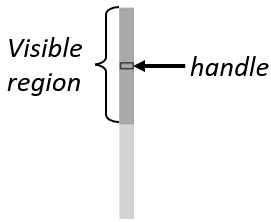
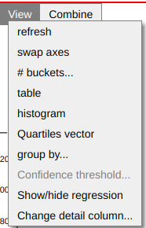

# Hillview User Manual

[Hillview](https://github.com/vmware/hillview) is a simple cloud-based
spreadsheet program for browsing large data collections.  Currently
the data manipulated is read-only.  Users can sort, find, filter,
transform, query, and chart data in some simple ways; several
operations are performed easily using direct manipulation in the GUI.
Hillview is designed to work on very large data sets (billions of
rows), complementing tools such as Excel.

Hillview attempts to provide fast data manipulation.  The illusion of
fast manipulation is provided by deferring work: Hillview only
computes as much of the data as must be shown to the user.  For
example, when sorting a dataset, it only sorts the rows currently
visible on the screen.  Hillview performs all operations using a class
of very efficient algorithms, called “sketches”, which are constrained
to compute with bounded memory over distributed data.

## System architecture

The spreadsheet is a three-tier system, as shown in the following figure:


* The user-interface (UI) runs in a browser.

* The service is exposed by a web server which runs in a datacenter on
  a head node.

* The service runs on a collection of servers in the datacenter;
  ideally these servers also store the data that is being browsed.

The Hillview service is implemented in Java.  The UI is written in
TypeScript.

Hillview can run as a federated system or loosely interconnected
components; the head node only sends small queries to the servers, and
it receivers small results from these.  The data on the server is
never sent over the network; the servers locally compute all results
that are needed.

## Streaming interaction

Users initiate operations in Hillview by performing operations within
the browser.  As a result of an operation, the back-end computes the
result as a series of approximations; these incremental results are
streamed back to the client and rendered, presenting the output with
gradually increasing precision.  Incremental results are always
accompanied by a progress bar, as in the following figure:


Pressing the "stop" button next to a progress bar will cancel the
currently-executing operation.

## Data model

The Hillview data model is a large table, with a relatively small
number of columns (tens) and many rows (millions to billions).

The data in each column is typed; Hillview supports the following data
types:
  * String
  * Category (represented as strings)
  * JSON (represented as strings)
  * Double
  * Integer (32-bit)
  * Dates and times
  * Time intervals

Hillview supports a special value "missing" which indicates that a
value is not present.  This is similar to NULL values in databases.

## Interacting with data

In this section we describe the various ways to present and interact
with the data.

### Loading data sets

Hillview supports reading data from multiple data-sources.

*TODO*

The final UI for loading datasets is not yet implemented.  Currently
this UI consists in some buttons that load pre-defined datasets.

#### Reading CSV files

Hillview can read data from comma- or tab-separated files.

*TODO*

#### Reading data from SQL databases

Hillview can read data from one or many SQL databases (any database
that supports the JDBC standard for reading).

Numeric values are converted either to integers (if they fit into
32-bits) or to doubles.  Boolean values are read as categories
containing two values, "true" and "false".

*TODO*

#### Reading data from Parquet files and Impala databases

Hillview can read data directly from
[Parquet](https://parquet.apache.org/) files on disk.  The
[Impala](https://impala.apache.org/) database uses Parquet to store
data.

Parquet Int96 data types are read as Datetime values.  Boolean values
are read as categories containing two values, "true" and "false".

*TODO*

### Table views

The next figure shows a typical table view.


A table view displays only some of the columns of the data.  The
header of the visible columns is written in bold letters.  The
following image shows a table header with 15 columns out of which 3
are visible:


The data in the table is always sorted lexicographically on a
combination of the visible columns.  In the figure above the data is
sorted as follows:

* Data is sorted first on the Origin column in decreasing order (this
  is shown by the down-arrow next to the column name followed by a
  zero; this is the zero-th column in the sorting order)

* When two rows have the same Origin value, they are next compared on
  the UniqueCarrier column, also in decreasing order

* Finally, when two rows have the same value in the Origin and
  UniqueCarrier columns, they are next ordered by their value in the
  Cancelled column, also in decreasing order.

This display is equivalent with the output of the following SQL query:

```SQL
SELECT COUNT(*), Origin, UniqueCarrier, Cancelled FROM data
GROUP BY Origin, UniqueCarrier, Cancelled
ORDER BY Origin ASC, UniqueCarrier ASC, Cancelled ASC
LIMIT 0, 19
```

Initially a table view displays no columns.  The user can choose which
columns are displayed or hidden.

In the tabular display a visible row can correspond to multiple rows
in the original dataset.  For example, in this figure, the first
displayed row corresponds to 104,840 different rows in the dataset.
Otherwise said, if one ignores all columns except the 3 visible ones,
there are 104,840 rows that have these exact values in the chosen 3
columns (AA/SFO/0).  This is displayed in the first two columns of the
table:


The first column, labeled (position) indicates with a horizontal
scroll-bar where in the sorted order the current displayed row
resides.  In this figure the first row is at the beginning of the
sorted order (the dark bar is at the very left).  The second column,
labeled (count) indicates how many row in the dataset correspond to
the displayed row.  The scroll-bar also indicates what percentage of
the whole dataset is covered by this row; in this case we can see that
this row covers about 9% of the data.  You can see that, although the
table only has 20 rows, it actually displays information for 292,241
rows in the original dataset, or 24% of the data!

#### Scrolling

Because each displayed row summarizes information from multiple rows,
scrolling through a Hillview table is somewhat different from the
standard scrolling.  The scroll-bar image and interaction reflect
these differences.  The following image is a blow-up of the scroll bar
of the table above.



The "visible region" of the scroll-bar size depicts the amount of
information displayed.  In the previous figure the visible region is
about 1/4 of the scroll-bar, this indicates that the data displayed
covers 1/4 of the rows in the dataset.

The scroll-bar can be moved using the keyboard (page up, page down,
home and end), or dragged using the mouse.  When moving the scroll-bar
the size of the "visible region" can change, sometimes dramatically,
depending on the distribution of the values in the visible columns.

To drag the scroll-bar with the mouse one has to grab the narrow
scroll-bar handle which is at the middle of the visible region.
Dragging the scroll-bar allows the user to specify a *quantile* in the
sorted data-set.  For example, if the user drags the handle to the
middle of the scroll-bar, this indicates that the user wants to know
the rows around the *median* of the distribution.  Hillview will bring
into view a set of rows that includes the requested quantile.

#### Selecting columns

The user can select one or more column using the mouse:
* Clicking on a column will select the column
* Clicking while pressing shift button will select a range of
  contiguous columns
* Clicking while pressing the control button will add or remove the
  current column from the selection

The following image shows the header of a table with 6 selected
columns.


#### Operations on selected columns

Right-clicking on a column header pops up a menu that offers a set of
operations on the currently selected columns, as shown in the
following figure:


The contents of this menu may depend on the type of the column and on
the current state of the display.

* Show: the selected columns will be added to end of the current
  sorting order and the columns will become visible.

* Hide: the selected columns will be removed from the sorting order
  and they will be hidden.

* Estimate distinct elements: selecting this option will run a
  computation that estimates the number of distinct values that exist
  in the selected column.  The shown number is just an approximation,
  but it should be a good approximation.

* Sort ascending: The selected columns will be moved to the front of
  the sort order in ascending order.

* Sort descending: The selected columns will be moved to the front of
  the sort order in descending order.

* Heatmap: this option requires exactly two or three columns of
  suitable types to be selected; in this case, it will draw a heatmap
  plot of the data in these columns.  For Heatmaps see [Heat-map
  views](#heatmap-views).

* Histogram: this option requires exactly one or two columns of
  suitable types to be selected.  If one column is selected, this
  operation will draw a histogram of the data in the selected column.
  For one-dimensional histograms see
  [Uni-dimensional-histogram-views](#uni-dimensional histogram views).
  If two columns are selected this menu will draw a two-dimensional
  histogram of the data in the selected columns.  For two-dimensional
  histograms see [Two-dimensional
  histograms](#two-dimensional-histograms).

* Heavy hitters...: This will initiate a heavy hitters computation on
  the selected columns; this computation finds the most frequent
  values that appear in the selected columns.  The user is presented
  with a dialog for describing the parameters of the heavy hitters
  computation.

  

  The user has to specify a percentage, between .1 (1/1000 of the
  data) and 100 (the whole data).  The result is shown in a [heavy
  hitter view](#heavy-hitter-views).

* Filter...: this option will pop-up a dialog window that allows the user
  to filter the data in the selected column (this option requires only
  one column to be selected).  The user can specify a value to be
  sought, and a comparison, indicating whether filtering keeps values
  identical or different to the specified one.

  

* PCA...: principal component analysis.  [Principal Component
  Analysis](https://en.wikipedia.org/wiki/Principal_component_analysis)
  is a method to project data in a high-dimensional space to a
  lower-dimensional space while preserving as much of the "shape" of
  the data.  The must have selected a set of columns containing
  numerical data.  The number of columns is the original dimension of
  the data.

  

  The user must indicate the number of dimensions for the projection,
  which has to be smaller than the original number of columns.  The
  PCA analysis will append a set of numeric columns to the dataset,
  containing the result of the PCA analysis.  The name of each
  appended column will indicate the amount of variance in the original
  data that is captured by the column (0-100%).

* LAMP...: local affine multidimensional projection (experimental).
  This is another method to project a high-dimensional space to a
  low-dimensional space.  This method is currently not very scalable
  to large datasets; we are exploring methods to speed it up.  For
  more details see [LAMP](#lamp-projection).

* Convert...: convert the type of data in a column.  Only one column
  must be selected.

  

  The conversion allows the user to change the type of data in a
  column.  For example, a numeric column can be converted to a string
  column.  One particularly useful conversion allows a string column
  to be converted to a categorical column.  This can only succeed if
  the number of distinct values in the column is below 10,000.  After
  conversion a new column is appended to the table, containing the
  converted data.

#### Operations on tables


* Full dataset: selecting this option will open the table with the
  full dataset, as it looked when first loaded; all selected columns
  and filtering operations are undone.

* Refresh: this redraws the current view of the table.

* All columns: all columns will become visible by being added to the
  current sort order in order from left to right.

* No columns: all columns will be hidden.

### Heavy hitter views

A heavy hitters view shows the most frequent values that appear in the
dataset in a set of selected columns (above a certain user-specified
threshold).


The data is sorted in decreasing order of frequency.  Each row
displays a combination of values and its count and relative frequency
within the dataset.  A special that may appear is "Everything else",
which indicates the estimated number of rows that do not appear
frequently enough to be above the chosen threshold.

The following operations may be performed on a heavy hitters view:


* As table: switches back to a [table view](#table-views), but where
  the table only contains the rows with values in the set of heavy
  hitters.

* Get exact counts: runs a more expensive but more precise
  heavy-hitters computation which computes the exact frequency for
  each value.

### Uni-dimensional histogram views

A uni-dimensional histogram is a succinct representation of the data
in a column.  Histograms can be used to display numeric data (integers
or doubles), date/time values, time interval values, or categorical
values; see [below](#categorical-histograms) for a description of
categorical histograms.  A histogram is computed in two phases:

- first the range of the data in the column is computed (minimum and
  maximum values)

- the range is divided into a small number of equal buckets.  Then the
  data is scanned and the number of points in the column that fall in
  each bucket is computed.

A histogram is displayed as a bar chart, with one bar per bucket.  The
height of the bucket shows the number of values that fall within the
bucket.  The X axis corresponds to the column being plotted, and the Y
axis is the count of values within each bucket.  Histograms can be
computed only approximately, but in this case the error in each bar
should be smaller than one pixel in size.


On top of each bar is shown the size of the bar.  If the size is only
approximately the value is shown with an approximation sign: &#2248;.

The thin blue line shown is the cumulative distribution function
([CDF](https://en.wikipedia.org/wiki/Cumulative_distribution_function)).
The CDF is drawn on a different implicit vertical scale ranging
between 0 and 100%.  A point on the CDF curve at coordinate X shows
how many of the data points in the displayed column are smaller than X.

The window also displays the current coordinates of the mouse and the
position of a blue dot that is closest to the mouse on the CDF curve.


The "View" menu from a histogram display has the following functions:

* refresh: redraws the current histogram.

* table: switches to a tabular display of the data shown in the
  current histogram

* exact: (only shown if the current histogram is only approximately
  computed) redraws the current histogram display by computing
  precisely the histogram

* \#buckets: shows a menu that allows the user to specify the number
  of buckets; the histogram will be redrawn using the specified number
  of buckets

* correlate: allows the user to specify a second column and switches
  the display to a [two-dimensional
  histogram](#two-dimensional-histogram-views)

#### Mouse selection in histogram views

*TODO*

#### Categorical histograms

*TODO*

### Two-dimensional histogram views


*TODO*

### Heatmap views




*TODO*


*TODO*

### Combining two views


*TODO*

### LAMP projection

This is another method to project a high-dimensional space to a
low-dimensional space, called local affine multidimensional
projection.  This is based on the paper [Local Affine Multidimensional
Projection](http://ieeexplore.ieee.org/document/6065024/) from IEEE
Transactions on Visualization and Computer Graphics, vol 17, issue 12,
Dec 2011, by Paulo Joia, Danilo Coimbra, Jose A Cuminato, Fernando V
Paulovich, and Luis G Nonato.

This method only applies to numerical columns.  In this method the
user can interactively guide the projection.  This always projects the
set of selected columns down to 2 dimensions and plots the result as a
heatmap.

This menu below allows the user to choose parameters of the
projection.

  

The users is presented with a set of control-points which can be moved
around to guide the projection.  A typical projection is shown in the
following figure:

  

*TODO*

  

*TODO*