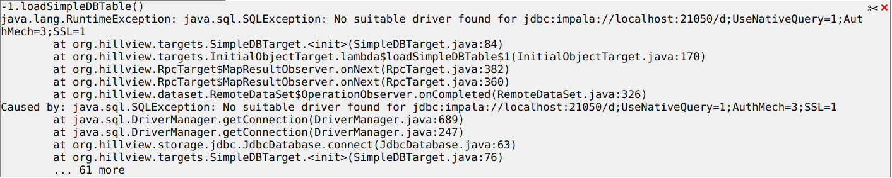
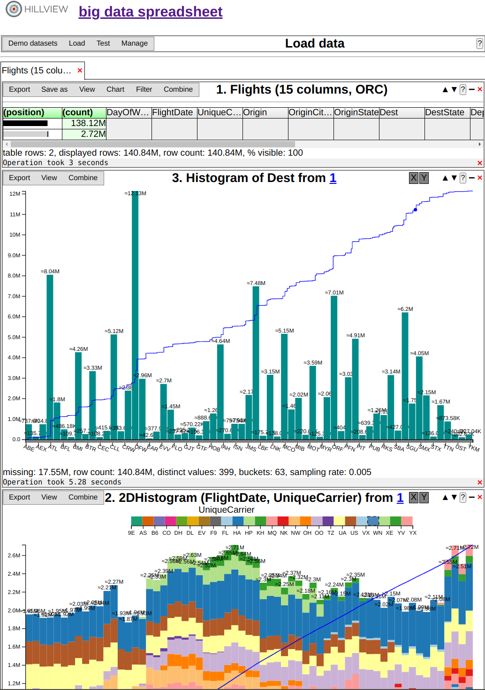
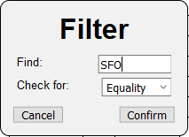
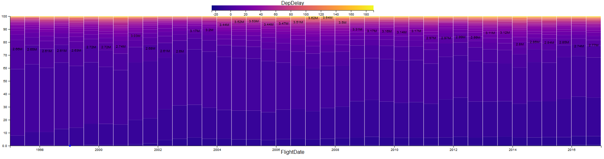

# Hillview User Manual

[Hillview](https://github.com/vmware/hillview) is a simple cloud-based
spreadsheet program for browsing large data collections.  Currently
the data manipulated is read-only.  Users can sort, find, filter,
transform, query, and chart data in simple ways;
operations are performed easily using direct manipulation in the GUI.
Hillview is designed to work on very large data sets (billions of
rows), with an interactive spreadsheet-like interaction style, complementing sophisticated analytic engines.  Hillview can also be
executed as a stand-alone executable on a local machine, but then the
data size it can manipulate is limited by the available machine
resources.

Hillview attempts to provide fast data manipulation.  The speed is obtained by deferring work: Hillview only
computes as much of the data as must be shown to the user.  For
example, when sorting a dataset, it only sorts the rows currently
visible on the screen.  Hillview performs all operations using a class
of very efficient algorithms, called “sketches”, which are constrained
to compute with bounded memory over distributed data.

## System architecture

The tool is a three-tier system, as shown in the following figure:


* The user-interface (UI) runs in a browser.

* The service is exposed by a web server which runs in a datacenter on
  a head node.

* The service runs on a collection of servers in the datacenter;
  ideally these servers also store the data that is being browsed.

The Hillview service is implemented in Java.  The UI is written in
TypeScript.

Hillview can run as a federated system or loosely interconnected
components; the head node only sends small queries to the servers, and
it receivers small results from these.  The data on the server is
never sent over the network; the servers locally compute all results
that are needed.

## Streaming interaction

Users initiate operations in Hillview by performing operations within
the browser.  As a result of an operation, the back-end computes the
result as a series of approximations; these incremental results are
streamed back to the client and rendered, presenting the output with
gradually increasing precision.  Incremental results are always
accompanied by a progress bar, as in the following figure:


Pressing the "stop" button next to a progress bar will cancel the
currently-executing operation.

## Data model

The Hillview data model is a large table, with a relatively small
number of columns (currently tens but would increase to hundreds soon) and many rows (millions to billions).

The data in each column is typed; Hillview supports the following data
types:
  * String
  * Category (represented as strings)
  * JSON (represented as strings)
  * Double
  * Integer (32-bit)
  * Dates and times
  * Time intervals

Hillview supports a special value "missing" which indicates that a
value is not present.  This is similar to NULL values in databases.

## Interacting with data

In this section we describe the various ways to present and interact
with the data.

## Error display

Some operations can trigger errors.  For example, the attempt to load
a non-existent file.  These errors usually manifest as Java exceptions
in the backend.  Today the Hillview front-end captures these
exceptions and displays them on the screen.  We are working to improve
the usability of error messages.



## Mouse-based selection

Several views allow the user to use the mouse to select data.
Selections can be modified using the keyboard as follows:

* Clicking on an element will select it and will unselect all other
  selected elements.

* Clicking while pressing shift button will select or unselect a whole
  range of contiguous elements.

* Clicking while pressing the control button
  will toggle the selection of the current element, while leaving the
  selection status of other elements unchanged.

### Loading data

Hillview supports reading data from multiple data-sources.

When the program starts the user is presented with a Load menu.


The load menu allows the user to specify a dataset to load from
storage.

* System logs: when this option is selected Hillview loads the logs
  produced by the Hillview system itself as a table with 9 columns.
  This is mostly useful to debug the performance of the Hillview
  system itself.

* CSV files: allows the user to [read data from a set of CSV
  files](#reading-csv-files).

* JSON files: allow the user to [read the data from a set of JSON
  files](#reading-json-files).

* DB tables: allows the user to [read data from a set of federated
  databases](#reading-data-from-sql-databases).

After the data loading is initiated the user will be presented with a
view of the loaded table.  If the table has relatively few columns,
the user is shown directly a [Tabular view](#table-views).  Otherwise
the user is shown a [Schema view](#data-schema-views), which can be
used to select a smaller set of columns to browse.

#### Reading CSV files

Hillview can read data from comma- or tab-separated files. The
following menu allows the users to specify the files to load.  *The
files must be resident on the same machines where the Hillview service
is deployed*.


* Folder: Folder containing the files to load.

* File name pattern: A shell expansion pattern that names the files to
  load.  Multiple files may be loaded on each machine.

* Schema file: An optional file in JSON format that describes the
  schema of the data.  In the absence of a schema file Hillview
  attempts to guess the type of data in each column.

* Header row: select this option if the first row in each CSV file is
  a header row; the first row is used to generate names for the
  columns in the absence of a schema.  If a schema is supplied the
  first row is just ignored.

All the CSV files must have the same schema (and the same number of
columns).  CSV files may be compressed.  CSV fields may be quoted
using double quotes, and then they may contain newlines.  An empty
field (contained between two consecutive commas, or between a comma
and a newline) is translated to a 'missing' data value.

The following is an example of a schema specification in JSON for a
table with 2 columns.

```JSON
[{
    "name": "DayOfWeek"
    "kind": "Integer",
    "allowMissing": true
}, {
    "name": "FlightDate"
    "kind": "Date",
    "allowMissing": false
}]
```

The schema is an array of JSON objects each describing a column.  A
column description has three fields:

* name: A string describing the column name.  All column names in a
  schema must be unique.

* allowMissing: A Boolean value which indicates whether the column can
  contain 'missing' values.

* kind: A string describing the type of data in the column,
  corresponding to the types in the [data model](#data-model).  The
  kind is one of: "String", "Category", "JSON", "Double", "Integer",
  "Date", and "Interval".

#### Reading JSON files

Hillview can read data from JSON files. The following menu allows the
users to specify the files to load.  *The files must be resident on
the same machines where the Hillview service is deployed*.


* Folder: Folder containing the files to load.

* File name pattern: A shell expansion pattern that names the files to
  load.  Multiple files may be loaded on each machine.

The assumed format is as follows:
- the file contains a single JSON array
- the array elements are flat JSON objects
- each value will become a row in the table
- all JSON objects have the same structure (schema)
- JSON objects generate a column for each property

All the JSON files must have the same schema.  JSON files may be
compressed.

#### Reading data from SQL databases

The following menu allows the user to load data from a set of
federated databases that are exposed as a JDBC service.  *Each worker
machine in the cluster will attempt to connect to the database
independently.* This works best when a separate database server is
deployed on each local Hillview machine hosting a worker.

Currently there is no way to load data from a single external database
when Hillview is deployed as a cloud service; however, data can be
loaded from a database when Hillview is deployed as a service running
on the local user machine.

The following menu allows the user to specify the data to load.


* database kind: A drop-down menu indicating the kind of database to
  load data from.  Currently we support 'mysql' and 'impala'.

* host: The network name of a machine hosting the database.  *TODO*
  this should be a pattern enabling each worker to specify a different
  machine.

* port: The network port where the database service is listening.

* database: The database to load data from.

* table: The table to load data from.

* user: The name of the user connecting to the database.

* password: Credentials of the user connecting to the database.

Numeric values are converted either to integers (if they fit into
32-bits) or to doubles.  Boolean values are read as categories
containing two values, "true" and "false".

#### Reading data from Parquet files

Hillview can read data directly from
[Parquet](https://parquet.apache.org/) files on disk.  The
[Impala](https://impala.apache.org/) database uses Parquet to store
data.

Parquet Int96 data types are read as Datetime values.  Boolean values
are read as categories containing two values, "true" and "false".

*TODO*

### User interface organization

The Hillview user interface uses a single web page to display multiple
views of the same dataset.  As the user navigates the dataset new
views are opened and displayed.  This image shows a browser window
containing multiple views of the same dataset; three views are visible
in the browser window, and the user needs to scroll up and down to see
the views.



Each view has a heading that describes it briefly, as shown in the
following figure.  Each view has a unique number, shown on the
top-right.  The lineage of views is usually shown in the title,
allowing users to navigate from a view to the source view from which it
was generated.  Views can also be closed by clicking the button
marked with x.


### Data schema views

The data schema views allow users to browse the schema of the current
table and select a set of columns from the dataset to focus on. This
feature is especially useful when the table contains too many columns
to display at once, and the user wants to focus on a subset of them.

The following example shows a schema view; the rows in a schema view
are the description of the columns of the data table.  In this example
there are three rows selected.


There are two ways to modify the selection:
1. By [using the mouse](#mouse-base-selection).

2. Using the selection menus, which can be accessed either by
right-clicking on the **Name**, **Type** or **Allows Missing** column
headers, or by clicking on the **Select** menu option at the top left
as shown below.


Columns can be un/selected using either the name, type or Allows Missing
fields. We describe the search criteria allowed in detail below. In
all cases, the search returns a subset of column descriptions, which
can be added to or removed from the current selection.

* By Name: allows regular expression matching against the name of the column.


* By Type: allows choosing all columns of a particular type.


* By Allows Missing: allows choosing only those columns that allow/disallow
  missing values.


Once the user selects a set of column descriptions, they can display a view of the
data table restricted to the selected columns using the View/Selected columns menu.


* Selected columns: this displays a [table view](#table-views) of the
data restricted to the selected columns.

### Table views

The next figure shows a typical table view.


A table view displays only some of the columns of the data.  The
header of the visible columns is written in bold letters.  The
following image shows a table header with 15 columns out of which 3
are visible:


The data in the table is always sorted lexicographically on a
combination of the visible columns.  In the figure above the data is
sorted as follows:

* Data is sorted first on the Origin column in decreasing order (this
  is shown by the down-arrow next to the column name followed by a
  zero; this is the zero-th column in the sorting order)

* When two rows have the same Origin value, they are next compared on
  the UniqueCarrier column, also in decreasing order

* Finally, when two rows have the same value in the Origin and
  UniqueCarrier columns, they are next ordered by their value in the
  Cancelled column, also in decreasing order.

This display is equivalent to the output of the following SQL query:

```SQL
SELECT COUNT(*), Origin, UniqueCarrier, Cancelled FROM data
GROUP BY Origin, UniqueCarrier, Cancelled
ORDER BY Origin ASC, UniqueCarrier ASC, Cancelled ASC
LIMIT 0, 19
```

Initially a table view displays no columns.  The user can choose which
columns are displayed or hidden.

Missing values are shown with a different color.  When sorting missing
values are considered larger than any other value.


In the tabular display a visible row can correspond to multiple rows
in the original dataset.  For example, in this figure, the first
displayed row corresponds to 104,840 different rows in the dataset.
Otherwise said, if one ignores all columns except the 3 visible ones,
there are 104,840 rows that have these exact values in the chosen 3
columns (AA/SFO/0).  This is displayed in the first two columns of the
table:


The first column, labeled (position) indicates with a horizontal
scroll-bar where in the sorted order the current displayed row
resides.  In this figure the first row is at the beginning of the
sorted order (the dark bar is at the very left).  The second column,
labeled (count) indicates how many rows in the dataset correspond to
the displayed row.  The scroll-bar also indicates what percentage of
the whole dataset is covered by this row; in this case we can see that
this row covers about 9% of the data.  You can see that, although the
table only has 20 rows, it actually displays information for 292,241
rows in the original dataset, or 24% of the data!

#### Scrolling

Because each displayed row summarizes information from multiple rows,
scrolling through a Hillview table is somewhat different from the
standard scrolling.  The scroll-bar image and interaction reflect
these differences.  The following image is a blow-up of the scroll bar
of the table above.


The "visible region" of the scroll-bar size depicts the amount of
information displayed.  In the previous figure the visible region is
about 1/4 of the scroll-bar, this indicates that the data displayed
covers 1/4 of the rows in the dataset.

The scroll-bar can be moved using the keyboard (page up, page down,
home and end), or dragged using the mouse.  When moving the scroll-bar
the size of the "visible region" can change, sometimes dramatically,
depending on the distribution of the values in the visible columns.

To drag the scroll-bar with the mouse one has to grab the narrow
scroll-bar handle which is at the middle of the visible region.
Dragging the scroll-bar allows the user to specify a *quantile* in the
sorted data-set.  For example, if the user drags the handle to the
middle of the scroll-bar, this indicates that the user wants to know
the rows around the *median* of the distribution.  Hillview will bring
into view a set of rows that includes the requested quantile.

#### Selecting columns

The user can [select](#mouse-based-selection) one or more column using
the mouse.  The following image shows the header of a table with 6
selected columns.


#### Operations on selected columns

Right-clicking on a column header pops up a menu that offers a set of
operations on the currently selected columns, as shown in the
following figure:


The contents of this menu may depend on the type of the column and on
the current state of the display.

* Show: the selected columns will be added to end of the current
  sorting order and the columns will become visible.

* Hide: the selected columns will be removed from the sorting order
  and they will be hidden.

* Estimate distinct elements: selecting this option will run a
  computation that estimates the number of distinct values that exist
  in the selected column.  The shown number is just an approximation,
  but it should be a good approximation.

* Sort ascending: The selected columns will be moved to the front of
  the sort order in ascending order.

* Sort descending: The selected columns will be moved to the front of
  the sort order in descending order.

* Heatmap: this option requires exactly two or three columns of
  suitable types to be selected.  When two columns are selected this
  will display the data in these columns as a [Heat-map
  view](#heatmap-views).  When three columns are selected the
  following menu allows the user to configure the data to display as a
  [Trellis plot view](#trellis-plot-views).

  

* Histogram: this option requires exactly one or two columns of
  suitable types to be selected.  If one column is selected, this
  operation will draw a histogram of the data in the selected column.
  For one-dimensional histograms see
  [Uni-dimensional-histogram-views](#uni-dimensional-histogram-views).
  If two columns are selected this menu will draw a two-dimensional
  histogram of the data in the selected columns.  For two-dimensional
  histograms see [Two-dimensional
  histograms](#two-dimensional-histograms).

* Heavy hitters...: This will initiate a heavy hitters computation on
  the selected columns; this computation finds the most frequent
  values that appear in the selected columns.  The user is presented
  with a dialog requesting the threshold parameter for the heavy hitters
  computation.

  

  The user has to specify a percentage, between .1 (1/1000 of the
  data) and 100 (the whole data).  The result is all items whose frequency
  in the selected columns is above the threshold. the result is shown in a [heavy
  hitter view](#heavy-hitter-views).

* Filter...: this option will pop-up a dialog window that allows the user
  to filter the data in the selected column (this option requires only
  one column to be selected).  The user can specify a value/pattern to be
  searched for (regular expressions are permitted), and also whether the
  matching values are to be kept or discarded.

  

* PCA...: principal component analysis.  [Principal Component
  Analysis](https://en.wikipedia.org/wiki/Principal_component_analysis)
  is a method to project data in a high-dimensional space to a
  lower-dimensional space while preserving as much of the "shape" of
  the data.  The user must have selected a set of columns containing
  numerical data.  The number of columns is the original dimension of
  the data.

  

  The user must indicate the number of dimensions for the projection,
  which has to be smaller than the original number of columns.  The
  PCA analysis will append a set of numeric columns to the dataset,
  containing the result of the PCA analysis.  The name of each
  appended column will indicate the amount of variance in the original
  data that is captured by the column (0-100%).

* LAMP...: local affine multidimensional projection (experimental).
  This is another method to project a high-dimensional space to a
  low-dimensional space.  This method is currently not very scalable
  to large datasets; we are exploring methods to speed it up.  For
  more details see [LAMP](#lamp-projection).

* Convert...: convert the type of data in a column.  Only one column
  must be selected.

  

  The conversion allows the user to change the type of data in a
  column.  For example, a numeric column can be converted to a string
  column.  One particularly useful conversion allows a string column
  to be converted to a categorical column.  This can only succeed if
  the number of distinct values in the column is below 10,000.  After
  conversion a new column is appended to the table, containing the
  converted data.

* Create column...: allows the user to write a JavaScript program that
  computes values for a new column.

  

  The user has to specify the new column name and type.  The
  JavaScript program is a function called 'map' that has a single
  argument called 'row'.  This function is invoked for every row of
  the dataset.  'row' is a JavaScript map that can be indexed with a
  string column name.

#### Operations on a table cell

The user can also right-click on a cell in a visible column to pop-up
a menu allowing filtering based on values; the menu permits to
keep/eliminate all rows that have the specified value in the selected
column.


#### Operations on tables

The tabular display has a "view" menu that offers the following
operations:


* Full dataset: selecting this option will open the table with the
  full dataset, as it looked when first loaded; all selected columns
  and filtering operations are undone.

* Refresh: this redraws the current view of the table.

* All columns: all columns will become visible by being added to the
  current sort order in order from left to right.

* No columns: all columns will be hidden.

* Schema: displays [the table schema](#data-schema-views).

For a description of the combine menu see [combining two views](#combining-two-views).

### Heavy hitter views

A heavy hitters view shows the most frequent values that appear in the
dataset in a set of selected columns (above a certain user-specified
threshold).


The data is sorted in decreasing order of frequency.  Each row
displays a combination of values and its count and relative frequency
within the dataset.  A special value that may appear is "Everything else",
which indicates the estimated number of rows that do not appear
frequently enough to be above the chosen threshold.

The following operations may be performed on a heavy hitters view:


* As table: switches back to a [table view](#table-views), but where
  the table only contains the rows with values in the set of heavy
  hitters.

* Get exact counts: runs a more expensive but more precise
  heavy-hitters computation which computes the exact frequency for
  each value.

### Uni-dimensional histogram views

A uni-dimensional (1D) histogram is a succinct representation of the
data in a column.  Histograms can be used to display numeric data
(integers or doubles), date/time values, time interval values, or
categorical values; see [below](#categorical-histograms) for a
description of categorical histograms.  A histogram is computed in two
phases:

- first the range of the data in the column is computed (minimum and
  maximum values).

- the range is divided into a small number of equal buckets.  Then the
  data is scanned and the number of points in the column that fall in
  each bucket is computed.

A histogram is displayed as a bar chart, with one bar per bucket.  The
height of the bucket shows the number of values that fall within the
bucket.  The X axis corresponds to the column being plotted, and the Y
axis is the count of values within each bucket.  Histograms can be
computed only approximately, but in this case the error in each bar
should be smaller than one pixel in size.

The total number of missing values is displayed below the histogram
itself, as a number.


A number on top of each bar indicates the size of the bar.  If the size is only
approximately the value is shown with an approximation sign: &asymp;.

The thin blue line shown is the cumulative distribution function
([CDF](https://en.wikipedia.org/wiki/Cumulative_distribution_function)).
The CDF is drawn on a different implicit vertical scale ranging
between 0 and 100%.  A point on the CDF curve at coordinate X shows
how many of the data points in the displayed column are smaller than X.

The window also displays the current coordinates of the mouse and the
position of a blue dot that is closest to the mouse on the CDF curve.


The "View" menu from a histogram display has the following functions:

* refresh: redraws the current histogram.

* table: switches to a tabular display of the data shown in the
  current histogram.

* exact: (only shown if the current histogram is only approximately
  computed) redraws the current histogram display by computing
  precisely the histogram.

* \#buckets: shows a menu that allows the user to specify the number
  of buckets; the histogram will be redrawn using the specified number
  of buckets.

* correlate: allows the user to specify a second column and switches
  the display to a [two-dimensional
  histogram](#two-dimensional-histogram-views)

For a description of the combine menu see [combining two views](#combining-two-views).

#### Mouse selection in histogram views

The mouse can be used to select a portion of the data in a histogram.
The user can click-and-drag to select a subset of the data.  The
selection chooses a contiguous range on the X axis.


When the user releases the mouse button the selection takes place.
The selection can be cancelled by pressing the ESC key.  The selection
can be complemented by pressing the CONTROL at the time the selection
is released (this will eliminate all the data that has been
selected).

#### Categorical histograms

When drawing a histogram of categorical data it is possible to have
more categories on the X axis than there are buckets.  In this case
each bucket will contain multiple categorical values, and one needs to
zoom-in by selecting to reveal the finer-grained structure of the data
in a bucket.  This case can be distinguished visually since there will
be multiple ticks on the X axis for each bucket.  The CDF function
will also probably indicate that the data has a higher resolution than
shown by the buckets alone.


The figure above shows a histogram where there are 294 distinct values
but only 40 buckets.  One can see multiple ticks in each bucket.  Only
some of the tick labels are displayed.

### Two-dimensional histogram views

A 2D histogram is a useful visual tool for estimating whether the
values in two columns are independent of each other.  Neither of the
two columns can be a String column.  A 2D histogram is a 1D histogram
where each bucket is further divided into sub-buckets according to the
distribution in a second column.


Next to the mouse an overlay box displays four different values:
* the mouse's position on the X axis
* the mouse's position on the Y axis
* the range of values corresponding to the bar where the mouse is placed
* the size of the bar (the number of rows corresponding to the bar)

For example, in this figure we see a 2D histogram where the X axis has
the airline carriers.  For each carrier the bar is divided into
sub-bars, each of which corresponding to a range of departure delays.
The color legend at the top shows the encoding of values into colors.

The handling of missing values is as follows:

* The count of rows values that have a missing value for the X axis is
shown at the bottom.

* For each bucket a transparent rectangle is used for the missing
  data.  The following image shows a 2D histogram where some buckets
  contain missing data.


The "view" menu for a 2D histogram offers the following operations:


* Refresh: this causes the histogram to be re-displayed.

* Table: Displays a tabular view of the data visible in the current
  histogram.

* Exact: Computes the histogram bar heights exactly.

* \#buckets: Allows the user to choose the number of buckets to use
  for the X axis.

* swap axes: Draws a new 2D histogram where the two columns are
  swapped.

* heatmap: Displays a [heat map](#heatmap-views) of the data using the
  same two columns as in the current histogram.

* percent/value: This toggles between displaying the 2D histogram bars
with relative sizes or normalized all to 100% height, as in the
following image.



For a description of the combine menu see [combining two views](#combining-two-views).

#### Selection in 2D histograms

In a 2D histogram users can select data in two ways:

* X-axis based selection: similar to 1D histograms, users can select a
  range on the X axis to zoom into.  Similar with 1D histogram
  selection, by keeping the Control button pressed when the mouse
  button is released the user will select the complement of the
  specified range.

* Colormap based selection: the user can select a range in the
  colormap to perform a selection of the data based on the second
  column, as shown in the following image.


### Heatmap views

A heatmap view displays the data in two columns.  Neither of the two
columns can be a string column.  The two columns are mapped to the two
axes of a plot, then the screen is divided into small patches a few
pixels wide and the number of data points that falls within each patch
is counted.  The number of values that falls within each patch is
displayed as a heatmap, where the color intensity indicates the number
of points.  A heatmap where the Y axis is not categorical will also
display a line that gives the best [linear regression](https://en.wikipedia.org/wiki/Linear_regression).
between the values in the two columns.

*TODO* discuss missing values.


The colormap of a heatmap can be adjusted using a drop-down menu that
appears when clicking the colormap.


The heatmap view menu has the following operations:


* refresh: Redraws the heatmap

* swap axes: Swaps the X and Y axes.

* table: Displays the data in the current heatmap in a tabular form.

* exact: Redraws the heatmap exactly.

* Histogram: Draws a [2D histogram](two-dimensional-histogram-views)
  of the data in the two columns that are used for the heatmap
  display.

For a description of the combine menu see [combining two views](#combining-two-views).

#### Selection from a heatmap

Users can select a rectangular area from a heatmap with the mouse.


### Trellis plot views


A Trellis plot is an array of heatmaps, grouped by a third column, which
currently is restricted to be a categorical column.
Each heatmap is comprised of the rows that have a specific value in the third (categorical)
column.

*TODO* discuss missing values

### Combining two views

Any view represents logically a subset of rows from an original table.
Two different views can be combined by performing a set operation
between the rows that they represent.  This is done using the "Combine"
menu, which is present in almost all views.


The operations are as follows:

* Select current: this selects the current view for a subsequent
  combining operation.

* Union: combines the previously-selected view with the current one by
  keeping all rows that appear in either view.

* Intersection: combines the previously-selected view with the current
  one by keeping only the rows that appear in both views.

* Exclude: combines the previously-selected view the current one by
  excluding from the current view all the rows from the previous one.

* Replace: replaces the data in the current view with the data from
  the previously-selected one.

### LAMP projection

(This is an experimental feature, which currently is too slow to
apply to large datasets.)  This is another method to project a
high-dimensional space to a low-dimensional space, called local affine
multidimensional projection.  This is based on the paper
[Local Affine Multidimensional Projection](http://ieeexplore.ieee.org/document/6065024/)
from IEEE Transactions on Visualization and Computer Graphics, vol 17, issue 12,
Dec 2011, by Paulo Joia, Danilo Coimbra, Jose A Cuminato, Fernando V
Paulovich, and Luis G Nonato.

This method only applies to numerical columns.  In this method the
user can interactively guide the projection.  This always projects the
set of selected columns down to 2 dimensions and plots the result as a
heatmap.

The menu below allows the user to choose parameters of the
projection.

  

The meaning of the parameters is as follows:

* Control-point selection: control points can be chosen either
  - by sampling a random set of rows from the table
  - by choosing as control points a representative for each value in a categorical column

* Number of control points: if the control points are selected by
  randomly sampling from the table this number indicates the number of
  control points produced.

* Category for centroids: the user must select a categorical column
  from the drop-down menu.  For each value in this column the average
  of all points in the selected columns will be used as a control
  point.

* Control point projection: currently only MDS (multi-dimensional
  scaling) is a possible choice.

After the LAMP projection is displayed, users are presented with a set
of control-points which can be moved around to guide the projection;
these are shown as green circles.  A typical projection is shown in
the following figure:

  

The "View" menu offers the following options:

  

* refresh: redraws the image.

* update ranges: recalculates the min/max range of the heatmap display
  to fit the data entirely.  When moving the handles the data range
  can expand or shrink.

* table: show a tabular view of the data represented in the LAMP view.

* 3D heat map: selecting this option opens a new menu which allows the
  user to make a [Trellis plot](#trellis-plot-views) of the
  two-dimensional data produced by the projection, by grouping all
  points that belong to a categorical value.
